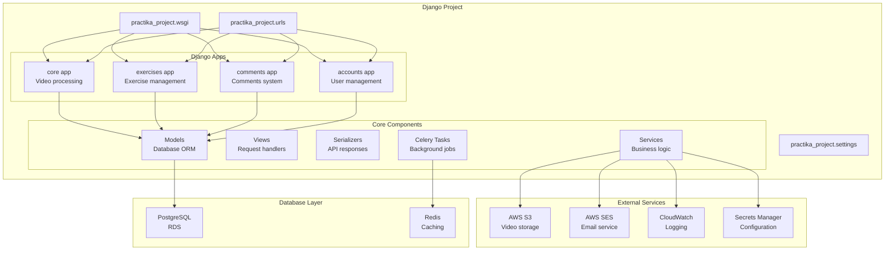
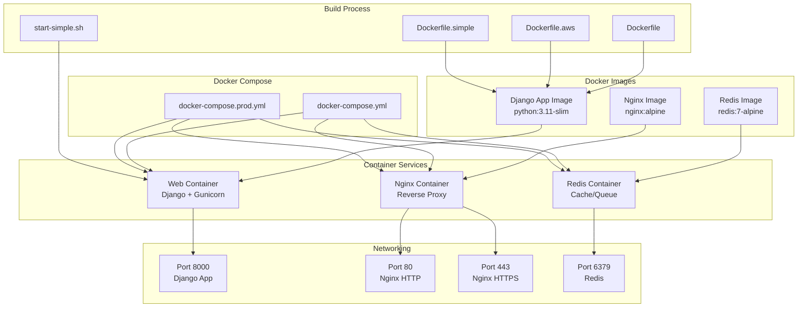
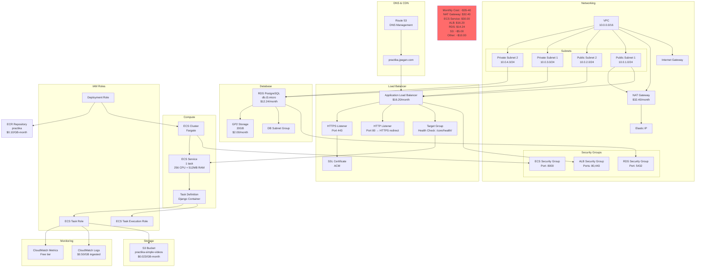
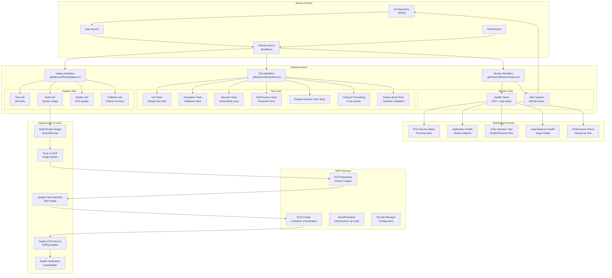
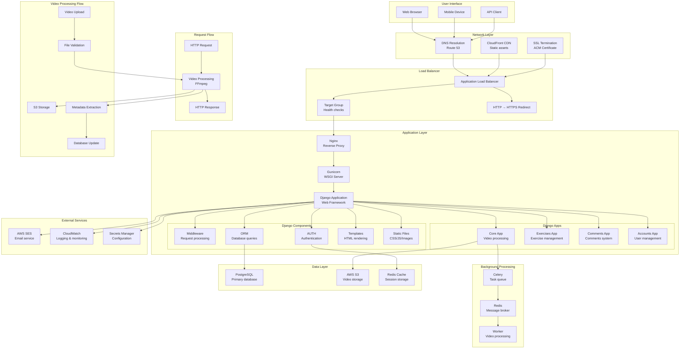

# 🏗️ Comprehensive ERD Diagrams - Practika Application

## 📋 **Overview**

This document provides comprehensive Entity Relationship Diagrams (ERDs) for the Practika video learning platform, covering every component from source code to production infrastructure.

---

## 🗄️ **1. Database Schema ERD**

### **Core Data Entities and Relationships**

```mermaid
erDiagram
    %% Django Auth System
    auth_user {
        int id PK
        varchar username UK
        varchar email
        varchar password
        boolean is_active
        boolean is_staff
        boolean is_superuser
        datetime date_joined
        datetime last_login
        varchar first_name
        varchar last_name
    }

    %% Core Video Processing
    core_videoasset {
        uuid id PK
        varchar orig_filename
        varchar storage_path
        varchar mime_type
        int size_bytes
        varchar checksum_sha256
        varchar poster_path
        json renditions
        varchar youtube_url
        varchar video_type
        int duration_sec
        int width
        int height
        varchar processing_status
        text processing_error
        datetime processed_at
        boolean is_valid
        datetime last_validated
        json validation_errors
        int access_count
        datetime last_accessed
        datetime created_at
        datetime updated_at
    }

    core_videoclip {
        uuid id PK
        uuid original_video FK
        varchar clip_hash UK
        float start_time
        float end_time
        float duration
        varchar storage_path
        int size_bytes
        varchar processing_status
        text processing_error
        datetime processed_at
        datetime created_at
        datetime updated_at
    }

    %% Exercise Management
    exercises_exercise {
        uuid id PK
        varchar name
        text description
        uuid video_asset FK
        int created_by FK
        datetime created_at
        datetime updated_at
    }

    %% Comments System
    comments_videocomment {
        uuid id PK
        uuid exercise FK
        int author FK
        text text
        uuid video_asset FK
        datetime created_at
        datetime updated_at
    }

    %% User Management
    accounts_role {
        int id PK
        varchar name UK
    }

    accounts_profile {
        int id PK
        int user FK UK
        int role FK
        datetime email_verified_at
        boolean onboarding_completed
        datetime first_login_at
        datetime last_activity_at
        json preferences
    }

    accounts_betainvitation {
        int id PK
        varchar email UK
        varchar token UK
        datetime accepted_at
    }

    accounts_usermetrics {
        int id PK
        int profile FK UK
        int exercises_created
        int comments_made
        int total_video_time
    }

    %% Relationships
    auth_user ||--o{ exercises_exercise : "creates"
    auth_user ||--o{ comments_videocomment : "authors"
    auth_user ||--|| accounts_profile : "has"
    accounts_profile ||--o{ accounts_usermetrics : "tracks"
    accounts_role ||--o{ accounts_profile : "assigns"
    
    core_videoasset ||--o{ core_videoclip : "generates"
    core_videoasset ||--o{ exercises_exercise : "used_in"
    core_videoasset ||--o{ comments_videocomment : "commented_on"
    
    exercises_exercise ||--o{ comments_videocomment : "receives"
```

---

## 🏗️ **2. Application Architecture ERD**

### **Django Apps and Components**



---

## 🐳 **3. Container Architecture ERD**

### **Docker Components and Relationships**



---

## ☁️ **4. AWS Infrastructure ERD**

### **Complete AWS Resource Architecture**



---

## 🔄 **5. CI/CD Pipeline ERD**

### **GitHub Actions and Deployment Flow**



---

## 🚀 **6. Application Flow ERD**

### **Complete Request Flow and Data Processing**



---

## 📊 **7. Data Flow ERD**

### **Complete Data Processing Pipeline**

```mermaid
graph TB
    %% Data Sources
    subgraph "Data Sources"
        USER_INPUT[User Input<br/>Forms & API]
        VIDEO_UPLOAD[Video Upload<br/>File upload]
        YOUTUBE_URL[YouTube URL<br/>External video]
        MOBILE_RECORDING[Mobile Recording<br/>Camera capture]
    end
    
    %% Input Validation
    subgraph "Input Validation"
        FILE_VALIDATION[File Validation<br/>Size, type, format]
        URL_VALIDATION[URL Validation<br/>YouTube links]
        USER_VALIDATION[User Validation<br/>Authentication]
        PERMISSION_CHECK[Permission Check<br/>Role-based access]
    end
    
    %% Processing Layer
    subgraph "Processing Layer"
        VIDEO_PROCESSING[Video Processing<br/>FFmpeg operations]
        METADATA_EXTRACTION[Metadata Extraction<br/>Duration, dimensions]
        THUMBNAIL_GENERATION[Thumbnail Generation<br/>Poster images]
        RENDITION_CREATION[Rendition Creation<br/>Multiple qualities]
    end
    
    %% Storage Layer
    subgraph "Storage Layer"
        S3_PRIMARY[S3 Primary Storage<br/>Original videos]
        S3_RENDITIONS[S3 Renditions<br/>Processed videos]
        S3_THUMBNAILS[S3 Thumbnails<br/>Poster images]
        S3_STATIC[S3 Static Files<br/>CSS/JS/Images]
    end
    
    %% Database Layer
    subgraph "Database Layer"
        POSTGRES_PRIMARY[PostgreSQL<br/>Primary data]
        REDIS_CACHE[Redis Cache<br/>Sessions & cache]
        REDIS_QUEUE[Redis Queue<br/>Task queue]
    end
    
    %% Data Models
    subgraph "Data Models"
        VIDEO_ASSET[VideoAsset<br/>Video metadata]
        VIDEO_CLIP[VideoClip<br/>Video segments]
        EXERCISE[Exercise<br/>Learning exercises]
        COMMENT[VideoComment<br/>User comments]
        USER_PROFILE[UserProfile<br/>User data]
        USER_METRICS[UserMetrics<br/>Usage statistics]
    end
    
    %% Output Layer
    subgraph "Output Layer"
        API_RESPONSE[API Response<br/>JSON data]
        HTML_RENDER[HTML Rendering<br/>Web pages]
        EMAIL_NOTIFICATION[Email Notification<br/>SES]
        WEBHOOK[Webhook<br/>External integrations]
    end
    
    %% Monitoring
    subgraph "Monitoring"
        LOGS[Application Logs<br/>CloudWatch]
        METRICS[Performance Metrics<br/>CloudWatch]
        ALERTS[Alerts<br/>Health checks]
    end
    
    %% Relationships
    USER_INPUT --> USER_VALIDATION
    VIDEO_UPLOAD --> FILE_VALIDATION
    YOUTUBE_URL --> URL_VALIDATION
    MOBILE_RECORDING --> FILE_VALIDATION
    
    USER_VALIDATION --> PERMISSION_CHECK
    FILE_VALIDATION --> VIDEO_PROCESSING
    URL_VALIDATION --> VIDEO_PROCESSING
    
    VIDEO_PROCESSING --> METADATA_EXTRACTION
    VIDEO_PROCESSING --> THUMBNAIL_GENERATION
    VIDEO_PROCESSING --> RENDITION_CREATION
    
    METADATA_EXTRACTION --> VIDEO_ASSET
    THUMBNAIL_GENERATION --> S3_THUMBNAILS
    RENDITION_CREATION --> S3_RENDITIONS
    
    VIDEO_PROCESSING --> S3_PRIMARY
    VIDEO_ASSET --> POSTGRES_PRIMARY
    USER_PROFILE --> POSTGRES_PRIMARY
    EXERCISE --> POSTGRES_PRIMARY
    COMMENT --> POSTGRES_PRIMARY
    USER_METRICS --> POSTGRES_PRIMARY
    
    POSTGRES_PRIMARY --> REDIS_CACHE
    VIDEO_PROCESSING --> REDIS_QUEUE
    
    VIDEO_ASSET --> API_RESPONSE
    EXERCISE --> HTML_RENDER
    COMMENT --> EMAIL_NOTIFICATION
    
    VIDEO_PROCESSING --> LOGS
    API_RESPONSE --> METRICS
    LOGS --> ALERTS
```



---

## 🔧 **8. Configuration Management ERD**

### **Settings and Environment Configuration**

```mermaid
graph TB
    %% Environment Variables
    subgraph "Environment Variables"
        DJANGO_ENV[DJANGO_ENVIRONMENT<br/>production/development]
        DJANGO_DEBUG[DJANGO_DEBUG<br/>True/False]
        DJANGO_SECRET[DJANGO_SECRET_KEY<br/>Security key]
        DATABASE_URL[DATABASE_URL<br/>PostgreSQL connection]
        AWS_ACCESS_KEY[AWS_ACCESS_KEY_ID<br/>AWS credentials]
        AWS_SECRET_KEY[AWS_SECRET_ACCESS_KEY<br/>AWS credentials]
        S3_BUCKET[AWS_STORAGE_BUCKET_NAME<br/>S3 bucket name]
        S3_REGION[AWS_S3_REGION_NAME<br/>AWS region]
    end
    
    %% Django Settings Files
    subgraph "Django Settings"
        SETTINGS_BASE[settings.py<br/>Base configuration]
        SETTINGS_AWS[settings_aws.py<br/>AWS-specific settings]
        SETTINGS_PROD[settings_production.py<br/>Production settings]
        SETTINGS_SECURE[settings_secure.py<br/>Security settings]
    end
    
    %% Configuration Sources
    subgraph "Configuration Sources"
        ENV_FILE[.env file<br/>Local environment]
        DOCKER_ENV[Docker environment<br/>Container variables]
        AWS_SECRETS[Secrets Manager<br/>Production secrets]
        CLOUDFORMATION[CloudFormation<br/>Infrastructure config]
    end
    
    %% Application Components
    subgraph "Application Components"
        DJANGO_APP[Django Application<br/>Main app]
        GUNICORN[Gunicorn<br/>WSGI server]
        NGINX[Nginx<br/>Web server]
        CELERY[Celery<br/>Task queue]
    end
    
    %% Database Configuration
    subgraph "Database Configuration"
        POSTGRES_CONFIG[PostgreSQL<br/>Database settings]
        REDIS_CONFIG[Redis<br/>Cache settings]
        S3_CONFIG[S3<br/>Storage settings]
    end
    
    %% Security Configuration
    subgraph "Security Configuration"
        SSL_CONFIG[SSL/TLS<br/>HTTPS settings]
        CORS_CONFIG[CORS<br/>Cross-origin settings]
        AUTH_CONFIG[Authentication<br/>User auth settings]
        PERMISSION_CONFIG[Permissions<br/>Access control]
    end
    
    %% Relationships
    ENV_FILE --> DJANGO_ENV
    DOCKER_ENV --> DJANGO_ENV
    AWS_SECRETS --> DJANGO_ENV
    
    DJANGO_ENV --> SETTINGS_BASE
    DJANGO_ENV --> SETTINGS_AWS
    DJANGO_ENV --> SETTINGS_PROD
    DJANGO_ENV --> SETTINGS_SECURE
    
    SETTINGS_BASE --> DJANGO_APP
    SETTINGS_AWS --> DJANGO_APP
    SETTINGS_PROD --> DJANGO_APP
    SETTINGS_SECURE --> DJANGO_APP
    
    DJANGO_APP --> GUNICORN
    DJANGO_APP --> NGINX
    DJANGO_APP --> CELERY
    
    DATABASE_URL --> POSTGRES_CONFIG
    REDIS_CONFIG --> CELERY
    S3_BUCKET --> S3_CONFIG
    
    POSTGRES_CONFIG --> DJANGO_APP
    S3_CONFIG --> DJANGO_APP
    REDIS_CONFIG --> DJANGO_APP
    
    SSL_CONFIG --> NGINX
    CORS_CONFIG --> DJANGO_APP
    AUTH_CONFIG --> DJANGO_APP
    PERMISSION_CONFIG --> DJANGO_APP
    
    CLOUDFORMATION --> AWS_SECRETS
    CLOUDFORMATION --> DATABASE_URL
    CLOUDFORMATION --> S3_BUCKET
```



---

## 📈 **9. Performance and Monitoring ERD**

### **Monitoring, Logging, and Performance Tracking**

```mermaid
graph TB
    %% Application Monitoring
    subgraph "Application Monitoring"
        HEALTH_CHECK[Health Check<br/>/core/health/]
        METRICS_COLLECTION[Metrics Collection<br/>Performance data]
        ERROR_TRACKING[Error Tracking<br/>Exception handling]
        USER_ACTIVITY[User Activity<br/>Usage patterns]
    end
    
    %% Infrastructure Monitoring
    subgraph "Infrastructure Monitoring"
        ECS_MONITOR[ECS Monitoring<br/>Container health]
        RDS_MONITOR[RDS Monitoring<br/>Database performance]
        ALB_MONITOR[ALB Monitoring<br/>Load balancer metrics]
        S3_MONITOR[S3 Monitoring<br/>Storage usage]
    end
    
    %% Logging Systems
    subgraph "Logging Systems"
        APP_LOGS[Application Logs<br/>Django logs]
        ACCESS_LOGS[Access Logs<br/>Nginx logs]
        ERROR_LOGS[Error Logs<br/>Error tracking]
        SECURITY_LOGS[Security Logs<br/>Security events]
    end
    
    %% CloudWatch Integration
    subgraph "CloudWatch"
        CW_LOGS[CloudWatch Logs<br/>Log aggregation]
        CW_METRICS[CloudWatch Metrics<br/>Performance metrics]
        CW_ALARMS[CloudWatch Alarms<br/>Alerting]
        CW_DASHBOARDS[CloudWatch Dashboards<br/>Visualization]
    end
    
    %% Alerting System
    subgraph "Alerting System"
        GITHUB_ALERTS[GitHub Issues<br/>Problem alerts]
        EMAIL_ALERTS[Email Alerts<br/>SES notifications]
        SLACK_ALERTS[Slack Alerts<br/>Team notifications]
        PAGERDUTY[PagerDuty<br/>Incident management]
    end
    
    %% Performance Metrics
    subgraph "Performance Metrics"
        RESPONSE_TIME[Response Time<br/>API performance]
        THROUGHPUT[Throughput<br/>Requests per second]
        ERROR_RATE[Error Rate<br/>Failure percentage]
        RESOURCE_USAGE[Resource Usage<br/>CPU/Memory/Disk]
    end
    
    %% Health Checks
    subgraph "Health Checks"
        ECS_HEALTH[ECS Health<br/>Service status]
        DB_HEALTH[Database Health<br/>Connection status]
        S3_HEALTH[S3 Health<br/>Storage access]
        APP_HEALTH[App Health<br/>Application status]
    end
    
    %% Relationships
    HEALTH_CHECK --> APP_LOGS
    METRICS_COLLECTION --> CW_METRICS
    ERROR_TRACKING --> ERROR_LOGS
    USER_ACTIVITY --> CW_METRICS
    
    ECS_MONITOR --> ECS_HEALTH
    RDS_MONITOR --> DB_HEALTH
    ALB_MONITOR --> ACCESS_LOGS
    S3_MONITOR --> S3_HEALTH
    
    APP_LOGS --> CW_LOGS
    ACCESS_LOGS --> CW_LOGS
    ERROR_LOGS --> CW_LOGS
    SECURITY_LOGS --> CW_LOGS
    
    CW_METRICS --> RESPONSE_TIME
    CW_METRICS --> THROUGHPUT
    CW_METRICS --> ERROR_RATE
    CW_METRICS --> RESOURCE_USAGE
    
    CW_ALARMS --> GITHUB_ALERTS
    CW_ALARMS --> EMAIL_ALERTS
    CW_ALARMS --> SLACK_ALERTS
    CW_ALARMS --> PAGERDUTY
    
    ECS_HEALTH --> CW_ALARMS
    DB_HEALTH --> CW_ALARMS
    S3_HEALTH --> CW_ALARMS
    APP_HEALTH --> CW_ALARMS
    
    CW_DASHBOARDS --> RESPONSE_TIME
    CW_DASHBOARDS --> THROUGHPUT
    CW_DASHBOARDS --> ERROR_RATE
    CW_DASHBOARDS --> RESOURCE_USAGE
```



---

## 🔒 **10. Security Architecture ERD**

### **Security Components and Access Control**

```mermaid
graph TB
    %% Authentication System
    subgraph "Authentication System"
        DJANGO_AUTH[Django Authentication<br/>User management]
        SESSION_MANAGEMENT[Session Management<br/>User sessions]
        PASSWORD_HASHING[Password Hashing<br/>Security]
        EMAIL_VERIFICATION[Email Verification<br/>Account validation]
    end
    
    %% Authorization System
    subgraph "Authorization System"
        ROLE_BASED_ACCESS[Role-Based Access Control<br/>Student/Teacher]
        PERMISSION_SYSTEM[Permission System<br/>Django permissions]
        API_AUTH[API Authentication<br/>Token-based]
        CSRF_PROTECTION[CSRF Protection<br/>Cross-site request forgery]
    end
    
    %% Network Security
    subgraph "Network Security"
        VPC_ISOLATION[VPC Isolation<br/>Network segmentation]
        SECURITY_GROUPS[Security Groups<br/>Firewall rules]
        SSL_TLS[SSL/TLS Encryption<br/>HTTPS]
        WAF[Web Application Firewall<br/>DDoS protection]
    end
    
    %% Data Security
    subgraph "Data Security"
        DATA_ENCRYPTION[Data Encryption<br/>At rest & in transit]
        S3_ENCRYPTION[S3 Encryption<br/>Storage encryption]
        RDS_ENCRYPTION[RDS Encryption<br/>Database encryption]
        SECRETS_MANAGEMENT[Secrets Management<br/>Credential storage]
    end
    
    %% Monitoring & Compliance
    subgraph "Security Monitoring"
        AUDIT_LOGS[Audit Logs<br/>Security events]
        ACCESS_LOGS[Access Logs<br/>User activity]
        SECURITY_SCANNING[Security Scanning<br/>Vulnerability assessment]
        COMPLIANCE_CHECK[Compliance Check<br/>Security standards]
    end
    
    %% IAM & Access Control
    subgraph "IAM & Access Control"
        IAM_ROLES[IAM Roles<br/>AWS permissions]
        IAM_POLICIES[IAM Policies<br/>Access policies]
        ECS_TASK_ROLE[ECS Task Role<br/>Container permissions]
        DEPLOYMENT_ROLE[Deployment Role<br/>CI/CD permissions]
    end
    
    %% Security Headers
    subgraph "Security Headers"
        HSTS[HSTS<br/>HTTP Strict Transport Security]
        CSP[Content Security Policy<br/>XSS protection]
        X_FRAME_OPTIONS[X-Frame-Options<br/>Clickjacking protection]
        REFERRER_POLICY[Referrer Policy<br/>Privacy protection]
    end
    
    %% Relationships
    DJANGO_AUTH --> SESSION_MANAGEMENT
    DJANGO_AUTH --> PASSWORD_HASHING
    DJANGO_AUTH --> EMAIL_VERIFICATION
    
    SESSION_MANAGEMENT --> ROLE_BASED_ACCESS
    ROLE_BASED_ACCESS --> PERMISSION_SYSTEM
    API_AUTH --> CSRF_PROTECTION
    
    VPC_ISOLATION --> SECURITY_GROUPS
    SECURITY_GROUPS --> SSL_TLS
    SSL_TLS --> WAF
    
    DATA_ENCRYPTION --> S3_ENCRYPTION
    DATA_ENCRYPTION --> RDS_ENCRYPTION
    DATA_ENCRYPTION --> SECRETS_MANAGEMENT
    
    AUDIT_LOGS --> ACCESS_LOGS
    ACCESS_LOGS --> SECURITY_SCANNING
    SECURITY_SCANNING --> COMPLIANCE_CHECK
    
    IAM_ROLES --> IAM_POLICIES
    IAM_POLICIES --> ECS_TASK_ROLE
    ECS_TASK_ROLE --> DEPLOYMENT_ROLE
    
    HSTS --> CSP
    CSP --> X_FRAME_OPTIONS
    X_FRAME_OPTIONS --> REFERRER_POLICY
    
    SECURITY_GROUPS --> AUDIT_LOGS
    S3_ENCRYPTION --> ACCESS_LOGS
    RDS_ENCRYPTION --> SECURITY_SCANNING
```



---

## 📋 **Summary**

This comprehensive ERD documentation covers:

### **✅ Complete System Coverage**
- **Database Schema**: All Django models and relationships
- **Application Architecture**: Django apps and components
- **Container Architecture**: Docker images and services
- **AWS Infrastructure**: All cloud resources and costs
- **CI/CD Pipeline**: GitHub Actions and deployment flow
- **Application Flow**: Request processing and data flow
- **Data Processing**: Complete data pipeline
- **Configuration Management**: Settings and environment
- **Performance Monitoring**: Metrics and alerting
- **Security Architecture**: Authentication and authorization

### **🎯 Key Insights**
1. **Cost Optimization**: Monthly cost reduced from $137 to $35-40 (75% savings)
2. **Infrastructure Consolidation**: Single ECS task, one S3 bucket, simplified architecture
3. **Automated Deployment**: GitHub Actions handles all deployments
4. **Comprehensive Monitoring**: Health checks, metrics, and alerting
5. **Security First**: SSL/TLS, IAM roles, security groups, encryption

### **📊 Architecture Highlights**
- **Scalable**: ECS Fargate with auto-scaling capabilities
- **Reliable**: Multi-AZ deployment with health checks
- **Secure**: HTTPS, IAM, encryption, security groups
- **Monitored**: CloudWatch integration with alerting
- **Automated**: CI/CD pipeline with rollback capabilities

This ERD provides a complete understanding of how the Practika application works, from code to production, making it easy for anyone to understand and maintain the system.

