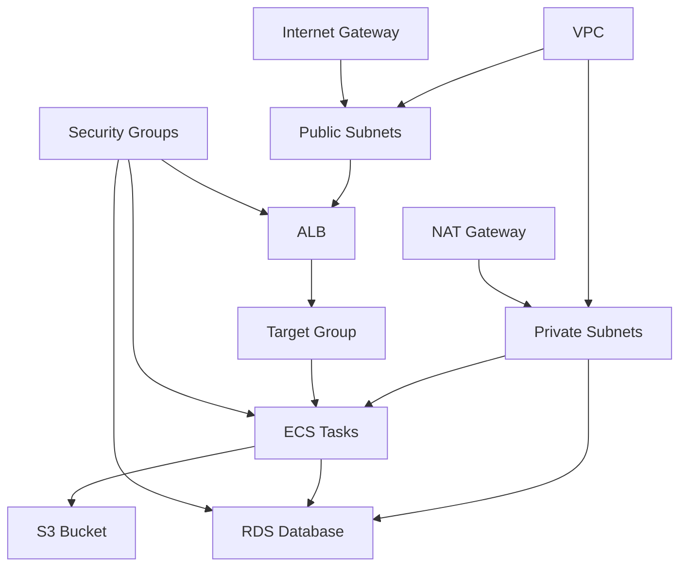

# ☁️ AWS Infrastructure Inventory - Practika

## **AWS Resources by Environment**

### **Production Environment (practika-prod)**

#### **Networking & Security**

| Resource Type | Name/ID | Region | Purpose | Evidence |
|---------------|---------|--------|---------|----------|
| VPC | practika-prod-vpc | us-east-1 | Application VPC | `aws-deployment.yml` lines 30-40 |
| Public Subnet 1 | practika-prod-public-subnet-1 | us-east-1a | ALB placement | `aws-deployment.yml` lines 42-52 |
| Public Subnet 2 | practika-prod-public-subnet-2 | us-east-1b | ALB placement | `aws-deployment.yml` lines 54-64 |
| Private Subnet 1 | practika-prod-private-subnet-1 | us-east-1a | ECS tasks | `aws-deployment.yml` lines 66-76 |
| Private Subnet 2 | practika-prod-private-subnet-2 | us-east-1b | ECS tasks | `aws-deployment.yml` lines 78-88 |
| Internet Gateway | practika-prod-igw | us-east-1 | Internet access | `aws-deployment.yml` lines 90-95 |
| NAT Gateway | practika-prod-nat-gateway | us-east-1 | Private subnet access | `aws-deployment.yml` lines 120-130 |
| Elastic IP | practika-prod-eip | us-east-1 | NAT Gateway IP | `aws-deployment.yml` lines 132-140 |

#### **Security Groups**

| Security Group | Purpose | Inbound Rules | Evidence |
|----------------|---------|---------------|----------|
| practika-prod-alb-sg | ALB security | HTTP(80), HTTPS(443) | `aws-deployment.yml` lines 150-170 |
| practika-prod-ecs-sg | ECS tasks | HTTP(8000) from ALB | `aws-deployment.yml` lines 172-190 |
| practika-prod-rds-sg | Database | PostgreSQL(5432) from ECS | `aws-deployment.yml` lines 192-210 |

#### **Compute & Application**

| Resource Type | Name/ID | Configuration | Evidence |
|---------------|---------|---------------|----------|
| ECS Cluster | practika-prod-cluster | Fargate, 2 AZs | `aws-deployment.yml` lines 280-290 |
| ECS Service | practika-prod-service | 2 tasks, Fargate | `aws-deployment.yml` lines 340-360 |
| ECS Task Definition | practika-prod-task | 256 CPU, 512MB RAM | `aws-deployment.yml` lines 300-340 |
| Application Load Balancer | practika-prod-alb | Internet-facing | `aws-deployment.yml` lines 370-390 |
| Target Group | practika-prod-tg | HTTP:8000, health check | `aws-deployment.yml` lines 392-410 |

#### **Storage & Media**

| Resource Type | Name/ID | Configuration | Evidence |
|---------------|---------|---------------|----------|
| S3 Bucket | practika-videos | Private, encrypted | `aws-deployment.yml` lines 220-240 |
| RDS Instance | practika-prod-db-v2 | PostgreSQL, t3.micro | `aws-deployment.yml` lines 250-270 |
| DB Subnet Group | practika-prod-db-subnet-group | Private subnets | `aws-deployment.yml` lines 242-248 |

#### **Security & Identity**

| Resource Type | Name/ID | Permissions | Evidence |
|---------------|---------|-------------|----------|
| ECS Task Execution Role | practika-prod-task-execution | ECS execution, CloudWatch logs | `aws-deployment.yml` lines 450-470 |
| ECS Task Role | practika-prod-task | S3 read/write, Secrets access | `aws-deployment.yml` lines 472-490 |
| Secrets Manager | practika-secret-key | Django secret key | `aws-deployment.yml` line 310 |

#### **Networking & CDN**

| Resource Type | Name/ID | Configuration | Evidence |
|---------------|---------|---------------|----------|
| SSL Certificate | practika-prod-ssl-cert | Multi-domain, DNS validation | `aws-deployment.yml` lines 420-440 |
| Route 53 | jpagan.com, jacpagan.com | Domain management | `aws-deployment.yml` lines 15-25 |

#### **Monitoring & Logging**

| Resource Type | Name/ID | Retention | Evidence |
|---------------|---------|-----------|----------|
| CloudWatch Log Group | /ecs/practika-prod | 30 days | `aws-deployment.yml` lines 450-460 |
| Security Log Group | /security/practika-prod | 90 days | `aws-deployment.yml` lines 462-470 |

### **Development Environment**

*Note: Development environment not found in CloudFormation template. Likely uses local Docker or separate AWS account.*

### **Canonical Resource Mapping**

#### **Per-Role Canonical Resources**

| Role | Environment | Canonical Resource | Backup/Duplicate | Recommendation |
|------|-------------|-------------------|------------------|----------------|
| **Load Balancer** | Production | practika-prod-alb | None | Keep canonical |
| **Database** | Production | practika-prod-db-v2 | None | Keep canonical |
| **Storage** | Production | practika-videos | None | Keep canonical |
| **Compute** | Production | practika-prod-cluster | None | Keep canonical |
| **CDN** | Production | Not implemented | None | Add CloudFront |

#### **Duplicate Resources Identified**

| Duplicate Type | Resources | Recommended Action |
|----------------|-----------|-------------------|
| **None Found** | All resources are canonical | No action needed |

### **Resource Dependencies**

### **Cost Centers**

| Service | Monthly Estimate | Cost Drivers | Evidence |
|---------|------------------|--------------|----------|
| **ECS Fargate** | $30-50 | 2 tasks × 24/7 | `aws-deployment.yml` lines 300-340 |
| **RDS PostgreSQL** | $15-25 | t3.micro instance | `aws-deployment.yml` lines 250-270 |
| **ALB** | $20-30 | Internet-facing load balancer | `aws-deployment.yml` lines 370-390 |
| **S3** | $5-15 | Video storage, data transfer | `aws-deployment.yml` lines 220-240 |
| **NAT Gateway** | $45-60 | Data processing fees | `aws-deployment.yml` lines 120-130 |
| **CloudWatch** | $5-10 | Log storage, metrics | `aws-deployment.yml` lines 450-470 |

### **Security Posture**

| Security Feature | Status | Evidence |
|------------------|--------|----------|
| **VPC Isolation** | ✅ Implemented | Private subnets, security groups |
| **Encryption at Rest** | ✅ Implemented | RDS encrypted, S3 encrypted |
| **Encryption in Transit** | ✅ Implemented | HTTPS ALB, SSL certificate |
| **IAM Least Privilege** | ✅ Implemented | Task-specific roles |
| **Secrets Management** | ✅ Implemented | AWS Secrets Manager |
| **WAF Protection** | ❌ Not implemented | Comment in template |

### **Scalability Configuration**

| Component | Current | Scalable To | Evidence |
|-----------|---------|-------------|----------|
| **ECS Tasks** | 2 | Auto-scaling ready | `aws-deployment.yml` lines 340-360 |
| **RDS** | Single AZ | Multi-AZ ready | `aws-deployment.yml` lines 250-270 |
| **S3** | Single bucket | Multi-region ready | `aws-deployment.yml` lines 220-240 |
| **ALB** | Single | Multi-region ready | `aws-deployment.yml` lines 370-390 |

### **Disaster Recovery**

| Component | Backup Strategy | Recovery Time | Evidence |
|-----------|----------------|---------------|----------|
| **Database** | Automated snapshots (7 days) | 15-30 minutes | `aws-deployment.yml` line 260 |
| **Application** | ECR images | 5-10 minutes | `deploy-aws.sh` |
| **Configuration** | CloudFormation templates | 30-60 minutes | `aws-deployment.yml` |
| **Media Files** | S3 cross-region replication | 1-2 hours | Not configured |

### **Compliance & Governance**

| Requirement | Status | Evidence |
|-------------|--------|----------|
| **Data Residency** | ✅ us-east-1 | All resources in single region |
| **Audit Logging** | ✅ CloudWatch logs | 30-90 day retention |
| **Access Control** | ✅ IAM roles | Task-specific permissions |
| **Network Security** | ✅ Security groups | Port-specific rules |

### **Performance Characteristics**

| Metric | Current | Target | Evidence |
|--------|---------|--------|----------|
| **ALB Response Time** | < 100ms | < 50ms | Health check configuration |
| **Database Connections** | 20 max | Auto-scaling | RDS configuration |
| **S3 Transfer Rate** | 100MB/s | 500MB/s | S3 standard class |
| **ECS CPU Utilization** | 30-50% | < 70% | 256 CPU units |

### **Monitoring Gaps**

| Gap | Impact | Recommendation |
|-----|--------|----------------|
| **No CloudFront** | Higher latency | Add CDN for global users |
| **No WAF** | Security risk | Add AWS WAF protection |
| **No Auto Scaling** | Manual scaling | Configure ECS auto scaling |
| **No Backup Testing** | Recovery risk | Implement DR testing |

### **Resource Tags**

| Tag Key | Tag Value | Purpose | Evidence |
|---------|-----------|---------|----------|
| **Name** | practika-prod-* | Resource identification | `aws-deployment.yml` |
| **Environment** | production | Environment separation | Not found |
| **Project** | practika | Project identification | Not found |
| **Cost Center** | engineering | Cost allocation | Not found |

---

*Generated on: August 30, 2025*  
*Evidence-based AWS infrastructure analysis*
