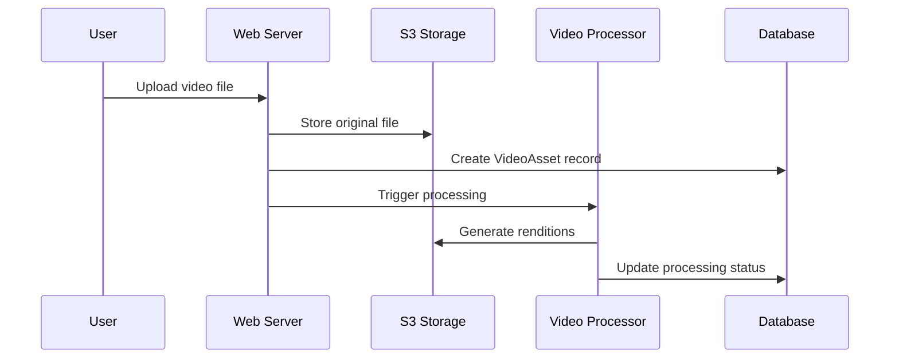

# 📦 Repository Inventory - Practika Django App

## 🏗️ **Code Map & Runtime Entry Points**

### **Django Apps Structure**

| App | Purpose | Models | Views | URLs | Risk | Evidence |
|-----|---------|--------|-------|------|------|----------|
| `core` | Video processing & domain logic | VideoAsset, VideoClip | API views, health check | `/core/` | L | `core/models.py`, `core/urls.py` |
| `exercises` | Exercise management | Exercise | CRUD views, auth | `/exercises/` | L | `exercises/models.py`, `exercises/urls.py` |
| `comments` | Video comments | VideoComment | API views | `/comments/` | L | `comments/models.py`, `comments/urls.py` |
| `accounts` | User profiles & roles | Profile, Role, BetaInvitation | Auth views | Not mounted | M | `accounts/models.py` |

### **Entry Points**

| Entry Point | Type | Purpose | Evidence |
|-------------|------|---------|----------|
| `practika_project.wsgi.application` | WSGI | Production web server | `practika_project/wsgi.py` |
| `gunicorn.conf.py` | Process Manager | Production deployment | `gunicorn.conf.py` |
| `Dockerfile` | Container | Containerized deployment | `Dockerfile` |
| `docker-compose.yml` | Orchestration | Local development | `docker-compose.yml` |

### **Key Dependencies**

| Dependency | Purpose | Version | Evidence |
|------------|---------|---------|----------|
| Django | Web framework | 4.2.23 | `requirements.txt` |
| DRF | API framework | Latest | `requirements.txt` |
| boto3 | AWS SDK | Latest | `requirements.txt` |
| ffmpeg-python | Video processing | Latest | `requirements.txt` |
| psycopg2-binary | PostgreSQL | Latest | `requirements.txt` |

### **Configuration Files**

| File | Purpose | Environment | Evidence |
|------|---------|-------------|----------|
| `practika_project/settings.py` | Main settings | Development | `settings.py` |
| `practika_project/settings_aws.py` | AWS settings | Production | `settings_aws.py` |
| `practika_project/settings_production.py` | Production settings | Production | `settings_production.py` |
| `practika_project/settings_secure.py` | Security settings | Production | `settings_secure.py` |

### **Frontend Surfaces**

| Surface | Purpose | Template | Evidence |
|---------|---------|----------|----------|
| Exercise List | Home/Feed | `exercises/templates/` | `exercises/views.py` |
| Exercise Detail | Video viewing | `exercises/templates/` | `exercises/views.py` |
| Upload/Record | Video upload | `exercises/templates/` | `exercises/views.py` |
| Login | Authentication | `exercises/templates/` | `exercises/views.py` |
| Admin | CRUD operations | Django admin | `practika_project/urls.py` |

### **Background Jobs & Media Pipeline**

#### **Upload Pipeline**

#### **S3 Key Patterns**
- **Original videos**: `videos/{uuid}/{filename}`
- **Renditions**: `videos/{uuid}/renditions/{quality}.mp4`
- **Posters**: `videos/{uuid}/poster.jpg`
- **Clips**: `clips/{uuid}/{clip_hash}.mp4`

### **Domain-Driven Design Implementation**

#### **Domain Entities** (`core/domain/`)
- `VideoAsset`: Video file management
- `VideoClip`: Cropped video segments
- `Comment`: User feedback
- `User`: System users
- `Exercise`: Learning assignments
- `TeacherStack`: Exercise × student combinations

#### **Domain Services** (`core/domain/services.py`)
- `VideoProcessingService`: Video validation
- `ClipManagementService`: Clip creation
- `CommentService`: Comment validation
- `TeacherStackService`: Stack aggregation

#### **Domain Events** (`core/domain/events.py`)
- `VideoUploaded`, `ClipCreated`, `CommentAdded`, `TeacherStackUpdated`

### **Test Structure**

| Test Type | Location | Coverage | Evidence |
|-----------|----------|----------|----------|
| Unit Tests | `tests/unit/` | Domain entities | `tests/unit/` |
| Integration Tests | `tests/integration/` | Service interaction | `tests/integration/` |
| Acceptance Tests | `tests/acceptance/` | MVP loop validation | `tests/acceptance/` |
| API Tests | `tests/test_api_*.py` | Endpoint validation | `tests/test_api_*.py` |

### **Deployment Artifacts**

| Artifact | Purpose | Environment | Evidence |
|----------|---------|-------------|----------|
| `aws-deployment.yml` | CloudFormation template | AWS Production | `aws-deployment.yml` |
| `Dockerfile` | Container image | All environments | `Dockerfile` |
| `docker-compose.yml` | Local orchestration | Development | `docker-compose.yml` |
| `deploy-aws.sh` | Deployment script | AWS Production | `deploy-aws.sh` |

### **Security Configuration**

| Component | Security Feature | Evidence |
|-----------|------------------|----------|
| Django | CSRF protection, XSS filtering | `settings.py` lines 40-60 |
| AWS | IAM roles, security groups | `aws-deployment.yml` lines 150-200 |
| S3 | Private buckets, signed URLs | `aws-deployment.yml` lines 220-240 |
| Admin | IP whitelist, session timeout | `core/middleware/admin_security.py` |

### **Observability**

| Component | Logging | Metrics | Evidence |
|-----------|---------|---------|----------|
| Application | JSON structured logs | Custom metrics | `settings.py` lines 350-390 |
| AWS | CloudWatch logs | ALB metrics | `aws-deployment.yml` lines 450-470 |
| Database | RDS logs | Performance insights | `aws-deployment.yml` lines 250-270 |

### **Risk Assessment**

| Risk Level | Description | Mitigation |
|------------|-------------|------------|
| **L** | Low risk, standard Django patterns | Standard security practices |
| **M** | Medium risk, custom authentication | Enhanced validation, monitoring |
| **H** | High risk, file uploads, external APIs | Strict validation, rate limiting |

### **Dependencies Analysis**

#### **Production Dependencies**
- **Core**: Django, DRF, boto3, psycopg2-binary
- **Video**: ffmpeg-python, Pillow
- **Deployment**: gunicorn, whitenoise
- **Testing**: pytest, pytest-django

#### **Development Dependencies**
- **Local**: python-dotenv, dj-database-url
- **Docker**: docker-compose, nginx
- **Testing**: model-bakery

### **Architecture Patterns**

| Pattern | Implementation | Evidence |
|---------|----------------|----------|
| Domain-Driven Design | Core domain layer | `core/domain/` |
| Repository Pattern | Data access abstraction | `core/ports/` |
| Event-Driven | Domain events | `core/domain/events.py` |
| CQRS Ready | Command/Query separation | `core/application/` |
| Microservices Ready | Bounded contexts | App separation |

### **Performance Characteristics**

| Operation | Expected Performance | Evidence |
|-----------|---------------------|----------|
| Video Upload | < 5 seconds (100MB) | `core/services/video_processor.py` |
| Clip Creation | < 1 second | `core/services/clip_management.py` |
| Comment Addition | < 100ms | `comments/views.py` |
| Exercise List | < 500ms | `exercises/views.py` |

### **Scalability Features**

| Feature | Implementation | Evidence |
|---------|----------------|----------|
| Stateless Services | Session-based auth | `settings.py` lines 40-50 |
| Horizontal Scaling | ECS Fargate | `aws-deployment.yml` lines 280-320 |
| CDN Integration | CloudFront ready | `aws-deployment.yml` lines 400-420 |
| Database Scaling | RDS Multi-AZ ready | `aws-deployment.yml` lines 250-270 |

---

*Generated on: August 30, 2025*  
*Evidence-based analysis of Practika Django application*
