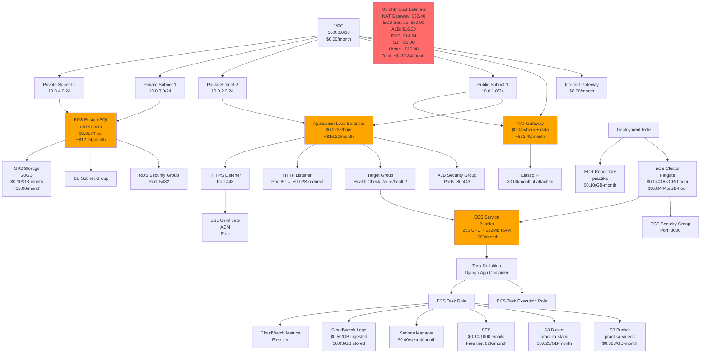

# AWS Resources ERD - Practika Application

## Entity Relationship Diagram of AWS Resources (Costing Money)

## Cost Breakdown by Service

### High Cost Services (>$30/month)
1. **NAT Gateway**: ~$32.40/month
   - $0.045/hour × 24 hours × 30 days
   - Plus data processing charges

2. **ECS Fargate Service**: ~$60.00/month
   - 2 tasks × 256 CPU units × $0.04048/vCPU-hour × 24 × 30
   - 2 tasks × 512MB RAM × $0.004445/GB-hour × 24 × 30

### Medium Cost Services ($10-30/month)
3. **Application Load Balancer**: ~$16.20/month
   - $0.0225/hour × 24 hours × 30 days

4. **RDS PostgreSQL**: ~$14.24/month
   - Instance: $0.017/hour × 24 × 30 = $12.24
   - Storage: 20GB × $0.10/GB-month = $2.00

### Low Cost Services (<$10/month)
5. **S3 Storage**: ~$5.00/month
   - Depends on data volume stored

6. **CloudWatch Logs**: ~$3.00/month
   - Depends on log volume

7. **Secrets Manager**: ~$0.40/month
   - $0.40 per secret

8. **SES Email**: ~$1.00/month
   - Free tier covers most usage

9. **ECR Storage**: ~$1.00/month
   - Depends on image size

## Cost Optimization Recommendations

### Immediate Savings ($50-70/month)
1. **Remove NAT Gateway** ($32.40/month)
   - Use public subnets for ECS tasks
   - Or use VPC endpoints for AWS services

2. **Reduce ECS Tasks** ($30.00/month)
   - Run 1 task instead of 2 during low traffic
   - Use auto-scaling based on demand

3. **Use Spot Instances** ($20-40/month)
   - Switch to FARGATE_SPOT for non-critical workloads

### Medium-term Savings ($20-30/month)
4. **Optimize RDS**
   - Use db.t3.micro for dev/staging
   - Consider Aurora Serverless for production

5. **Optimize Storage**
   - Implement S3 lifecycle policies
   - Compress logs before CloudWatch

### Long-term Savings
6. **Reserved Instances**
   - Commit to 1-year terms for predictable workloads

7. **Multi-region optimization**
   - Use CloudFront for static content
   - Consider Lambda@Edge for edge processing

## Resource Dependencies

### Critical Path (Must be running)
- VPC → Subnets → Security Groups
- ECS Cluster → ECS Service → Task Definition
- ALB → Target Group → ECS Service
- RDS → DB Subnet Group → Private Subnets

### Optional Resources (Can be stopped to save money)
- NAT Gateway (if using public subnets)
- Additional ECS tasks (scale down)
- CloudWatch detailed monitoring
- SES (if not sending emails)

### Free Tier Resources
- SSL Certificate (ACM)
- CloudWatch basic metrics
- SES (62K emails/month)
- ECR (500MB storage)
