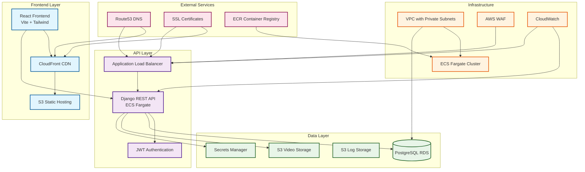

# Practika - System Architecture Overview

```mermaid
graph TB
    subgraph "Frontend Layer"
        UI["React Frontend<br/>Vite + Tailwind"]
        CF[CloudFront CDN]
        S3_STATIC[S3 Static Hosting]
    end

    subgraph "API Layer"
        ALB[Application Load Balancer]
        API["Django REST API<br/>ECS Fargate"]
        AUTH[JWT Authentication]
    end

    subgraph "Data Layer"
        RDS[(PostgreSQL RDS)]
        S3_VIDEOS[S3 Video Storage]
        S3_LOGS[S3 Log Storage]
        SECRETS[Secrets Manager]
    end

    subgraph "Infrastructure"
        VPC[VPC with Private Subnets]
        ECS[ECS Fargate Cluster]
        WAF[AWS WAF]
        CW[CloudWatch]
    end

    subgraph "External Services"
        ROUTE53[Route53 DNS]
        ACM[SSL Certificates]
        ECR[ECR Container Registry]
    end

    %% Frontend connections
    UI --> CF
    CF --> S3_STATIC
    UI --> API

    %% API connections
    ALB --> API
    API --> AUTH
    API --> RDS
    API --> S3_VIDEOS
    API --> SECRETS

    %% Infrastructure connections
    VPC --> ECS
    VPC --> RDS
    WAF --> ALB
    CW --> API
    CW --> ALB

    %% External connections
    ROUTE53 --> CF
    ROUTE53 --> ALB
    ACM --> CF
    ACM --> ALB
    ECR --> ECS

    %% Styling
    classDef frontend fill:#e1f5fe,stroke:#01579b,stroke-width:2px
    classDef api fill:#f3e5f5,stroke:#4a148c,stroke-width:2px
    classDef data fill:#e8f5e8,stroke:#1b5e20,stroke-width:2px
    classDef infra fill:#fff3e0,stroke:#e65100,stroke-width:2px
    classDef external fill:#fce4ec,stroke:#880e4f,stroke-width:2px

    class UI,CF,S3_STATIC frontend
    class ALB,API,AUTH api
    class RDS,S3_VIDEOS,S3_LOGS,SECRETS data
    class VPC,ECS,WAF,CW infra
    class ROUTE53,ACM,ECR external
```
