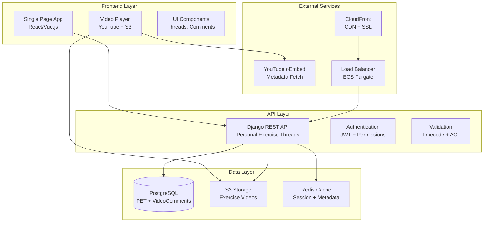
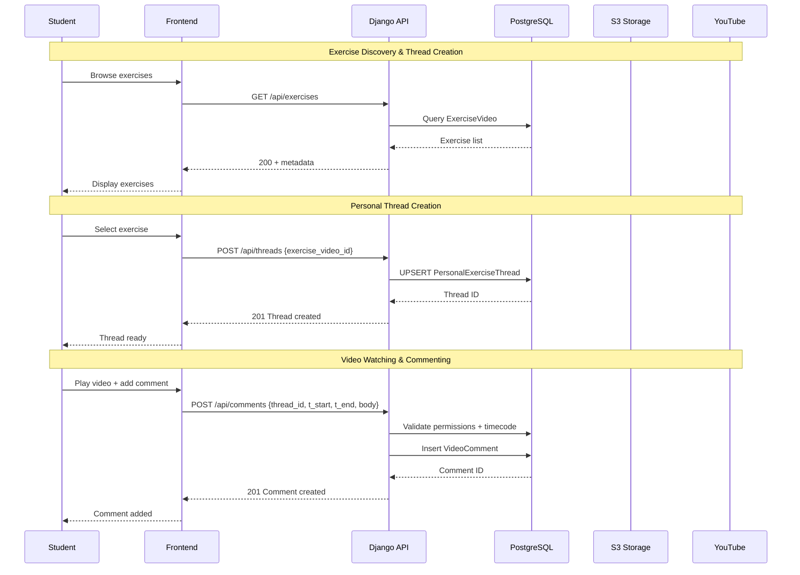
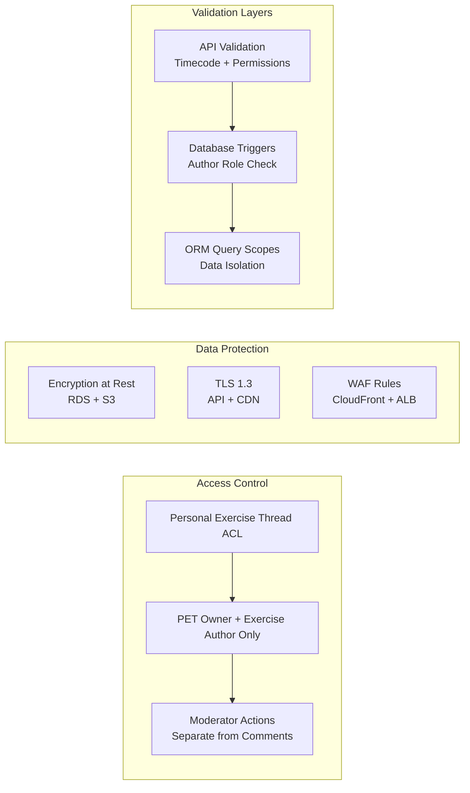
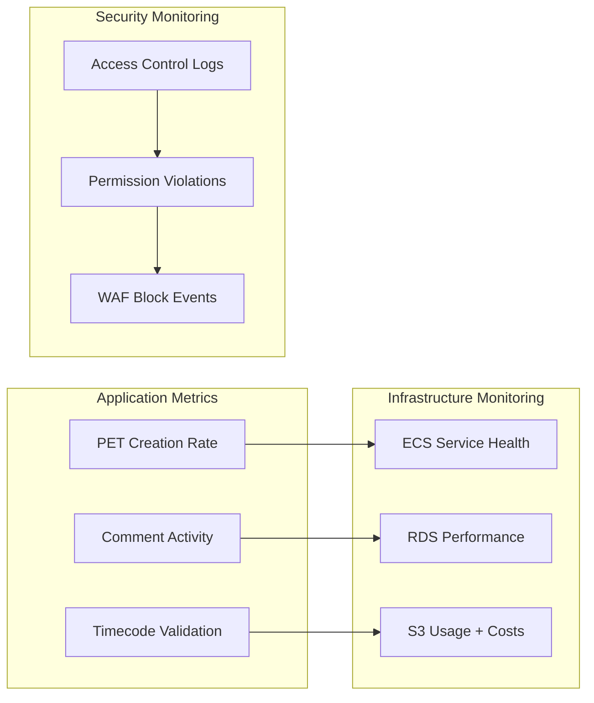
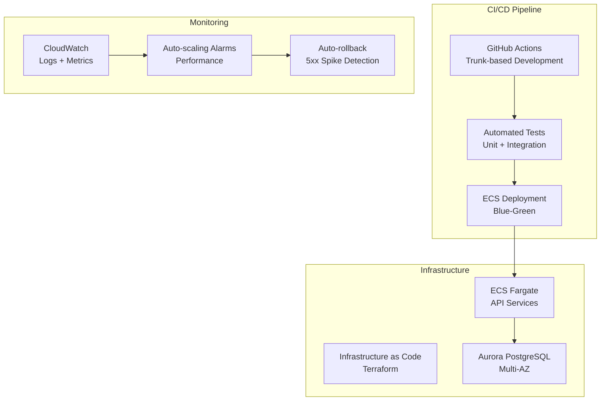
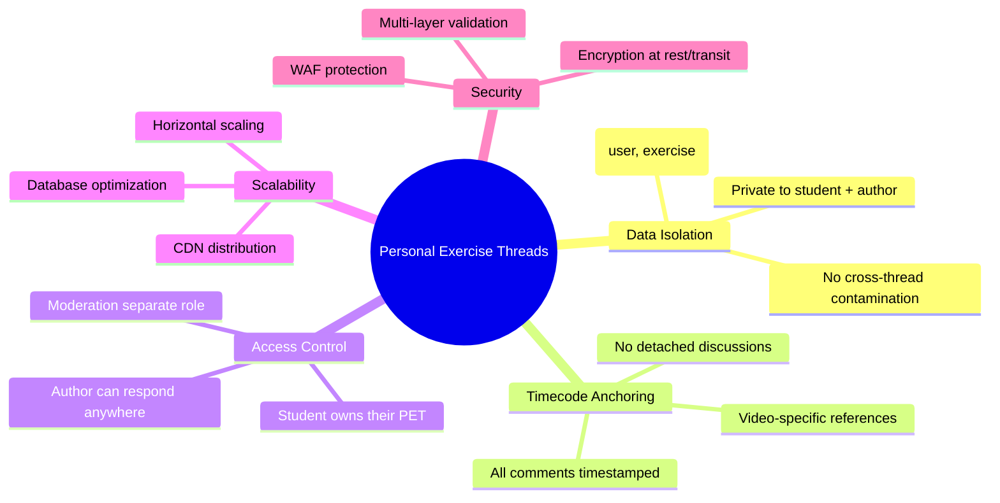

# System Architecture Overview

## Core Architecture

## Data Flow Architecture

## Security Architecture

## Scalability Architecture

```mermaid
graph TB
    subgraph "Horizontal Scaling"
        ECS[ECS Fargate<br/>Auto-scaling API]
        RDS[Read Replicas<br/>Query Distribution]
        REDIS[Redis Cluster<br/>Session + Cache]
    end

    subgraph "CDN & Caching"
        CF[CloudFront<br/>Global Distribution]
        S3[S3 + CloudFront<br/>Video Delivery]
        CACHE[API Response Cache<br/>Metadata]
    end

    subgraph "Database Optimization"
        PART[Table Partitioning<br/>By date/region]
        INDEX[Composite Indexes<br/>thread_id + timecode]
        ARCH[Archival Strategy<br/>Old threads]
    end

    ECS --> RDS
    RDS --> REDIS
    CF --> S3
    S3 --> CACHE
    PART --> INDEX
    INDEX --> ARCH
```

## Monitoring & Observability

## Deployment Architecture

## Key Design Principles

