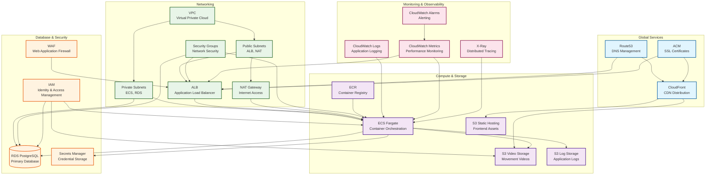

# Practika - AWS Infrastructure Components

```mermaid
graph TB
    subgraph "Global Services"
        ROUTE53[Route53<br/>DNS Management]
        ACM[ACM<br/>SSL Certificates]
        CLOUDFRONT[CloudFront<br/>CDN Distribution]
    end

    subgraph "Compute & Storage"
        ECS[ECS Fargate<br/>Container Orchestration]
        ECR[ECR<br/>Container Registry]
        S3_VIDEOS[S3 Video Storage<br/>Movement Videos]
        S3_STATIC[S3 Static Hosting<br/>Frontend Assets]
        S3_LOGS[S3 Log Storage<br/>Application Logs]
    end

    subgraph "Networking"
        VPC[VPC<br/>Virtual Private Cloud]
        ALB[ALB<br/>Application Load Balancer]
        SG[Security Groups<br/>Network Security]
        NAT[NAT Gateway<br/>Internet Access]
        SUBNET_PUB[Public Subnets<br/>ALB, NAT]
        SUBNET_PRIV[Private Subnets<br/>ECS, RDS]
    end

    subgraph "Database & Security"
        RDS[(RDS PostgreSQL<br/>Primary Database)]
        SECRETS[Secrets Manager<br/>Credential Storage]
        WAF[WAF<br/>Web Application Firewall]
        IAM[IAM<br/>Identity & Access Management]
    end

    subgraph "Monitoring & Observability"
        CW_LOGS[CloudWatch Logs<br/>Application Logging]
        CW_METRICS[CloudWatch Metrics<br/>Performance Monitoring]
        CW_ALARMS[CloudWatch Alarms<br/>Alerting]
        XRAY[X-Ray<br/>Distributed Tracing]
    end

    %% Global connections
    ROUTE53 --> CLOUDFRONT
    ROUTE53 --> ALB
    ACM --> CLOUDFRONT
    ACM --> ALB

    %% CDN connections
    CLOUDFRONT --> S3_STATIC
    CLOUDFRONT --> S3_VIDEOS

    %% Networking connections
    VPC --> SUBNET_PUB
    VPC --> SUBNET_PRIV
    SUBNET_PUB --> ALB
    SUBNET_PUB --> NAT
    SUBNET_PRIV --> ECS
    SUBNET_PRIV --> RDS
    ALB --> ECS
    NAT --> ECS
    SG --> ALB
    SG --> ECS
    SG --> RDS

    %% Compute connections
    ECR --> ECS
    ECS --> S3_VIDEOS
    ECS --> S3_LOGS
    ECS --> RDS
    ECS --> SECRETS

    %% Security connections
    WAF --> ALB
    IAM --> ECS
    IAM --> RDS
    IAM --> S3_VIDEOS

    %% Monitoring connections
    CW_LOGS --> ECS
    CW_METRICS --> ECS
    CW_METRICS --> ALB
    CW_ALARMS --> CW_METRICS
    XRAY --> ECS

    %% Styling
    classDef global fill:#e1f5fe,stroke:#01579b,stroke-width:2px
    classDef compute fill:#f3e5f5,stroke:#4a148c,stroke-width:2px
    classDef network fill:#e8f5e8,stroke:#1b5e20,stroke-width:2px
    classDef security fill:#fff3e0,stroke:#e65100,stroke-width:2px
    classDef monitoring fill:#fce4ec,stroke:#880e4f,stroke-width:2px

    class ROUTE53,ACM,CLOUDFRONT global
    class ECS,ECR,S3_VIDEOS,S3_STATIC,S3_LOGS compute
    class VPC,ALB,SG,NAT,SUBNET_PUB,SUBNET_PRIV network
    class RDS,SECRETS,WAF,IAM security
    class CW_LOGS,CW_METRICS,CW_ALARMS,XRAY monitoring
```
