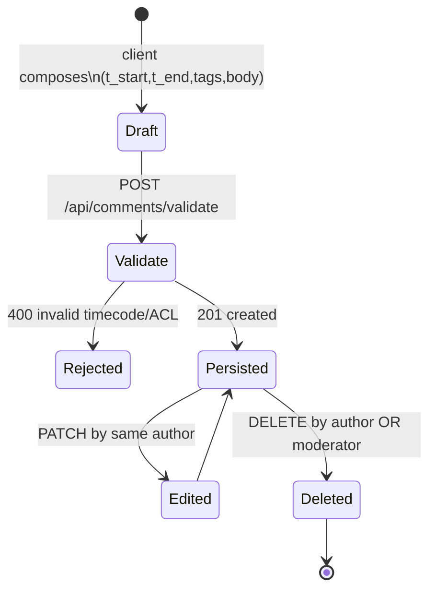
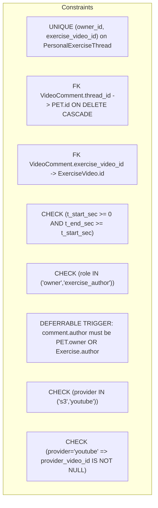
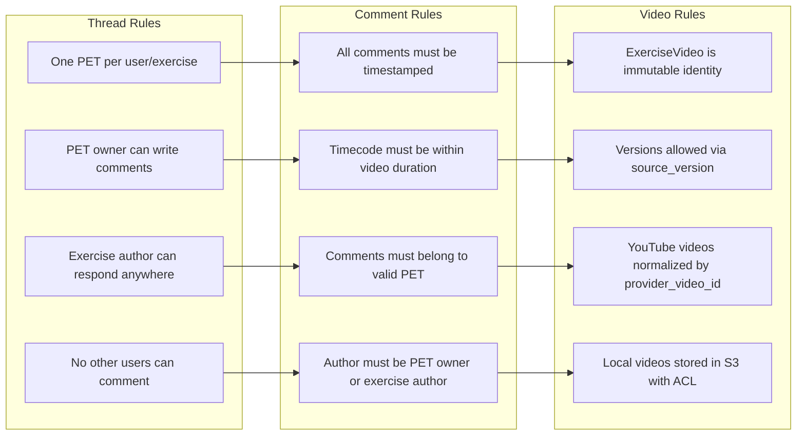
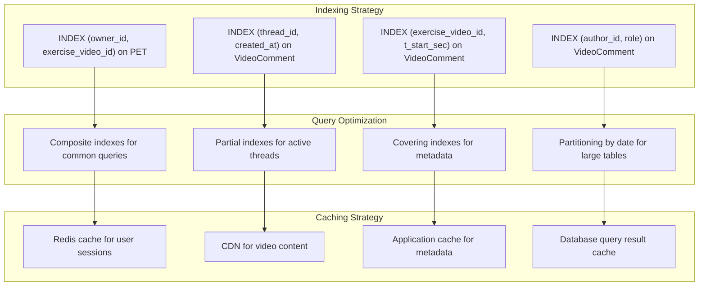

# Database Entity Relationship Diagram

## Core ERD

```mermaid
erDiagram
    %% Users & Roles
    User {
        uuid id PK
        string username UK
        string email UK
        bool is_admin
        datetime created_at
    }
    
    %% Canonical exercise video (local or YouTube)
    ExerciseVideo {
        uuid id PK
        uuid author_id FK
        string title
        string provider "enum: s3,youtube"
        string source_uri "s3://bucket/key or https://youtu.be/ID"
        string provider_video_id "nullable unless provider=youtube"
        int duration_sec
        string visibility "enum: public, link, private"
        int source_version
        datetime created_at
        datetime published_at
    }
    
    %% One thread per (user, exercise_video)
    PersonalExerciseThread {
        uuid id PK
        uuid owner_id FK
        uuid exercise_video_id FK
        string status "enum: open, archived"
        datetime created_at
        datetime last_activity_at
        UNIQUE (owner_id, exercise_video_id)
    }
    
    %% Only timestamp-anchored comments inside PET
    VideoComment {
        uuid id PK
        uuid thread_id FK
        uuid exercise_video_id FK
        uuid author_id FK
        int t_start_sec
        int t_end_sec
        string[] tags
        text body_md
        string role "enum: owner, exercise_author"
        datetime created_at
        datetime updated_at
    }
    
    %% Optional tagging for analytics/search
    Tag {
        uuid id PK
        string slug UK
        string label
    }
    
    VideoComment_Tag {
        uuid id PK
        uuid comment_id FK
        uuid tag_id FK
        UNIQUE (comment_id, tag_id)
    }

    %% Relationships
    User ||--o{ ExerciseVideo : "authors"
    User ||--o{ PersonalExerciseThread : "owns"
    ExerciseVideo ||--o{ PersonalExerciseThread : "is threaded by"
    PersonalExerciseThread ||--o{ VideoComment : "contains"
    ExerciseVideo ||--o{ VideoComment : "anchors"
    User ||--o{ VideoComment : "writes"
    VideoComment ||--o{ VideoComment_Tag : "has"
    Tag ||--o{ VideoComment_Tag : "labels"
```

## Access Control Model

```mermaid
flowchart LR
    subgraph Actors
        A[Student (PET Owner)]
        B[Exercise Author (OP)]
        C[Other Users]
        D[Admin/Mod]
    end

    subgraph Objects
        EV[ExerciseVideo]
        PET[PersonalExerciseThread]
        VC[VideoComment]
    end

    %% Permissions legend: R=Read, W=Write, X=Moderate/Delete
    A --- EV:::r
    A --- PET:::rw
    A --- VC:::rw

    B --- EV:::r
    B --- PET:::rw
    B --- VC:::rw

    C --- EV:::r
    C --- PET:::deny
    C --- VC:::deny

    D --- EV:::rx
    D --- PET:::rx
    D --- VC:::rx

    classDef r fill:#e8f5ff,stroke:#1e88e5,stroke-width:1px;
    classDef rw fill:#e8ffe8,stroke:#43a047,stroke-width:1px;
    classDef rx fill:#fff3e0,stroke:#fb8c00,stroke-width:1px;
    classDef deny fill:#ffebee,stroke:#e53935,stroke-width:1px;
```

## Comment Lifecycle



## Database Constraints



## Key Business Rules



## Performance Considerations



## Security Features

```mermaid
graph LR
    subgraph "Data Protection"
        DP1[Encryption at rest (RDS)]
        DP2[Encryption in transit (TLS 1.3)]
        DP3[S3 bucket encryption]
        DP4[Column-level encryption for sensitive data]
    end

    subgraph "Access Control"
        AC1[Row-level security (RLS)]
        AC2[Database triggers for authorization]
        AC3[ORM query scopes]
        AC4[API-level permission checks]
    end

    subgraph "Audit & Monitoring"
        AM1[Comprehensive audit logs]
        AM2[Permission violation alerts]
        AM3[Data access monitoring]
        AM4[Compliance reporting]
    end

    DP1 --> AC1
    DP2 --> AC2
    DP3 --> AC3
    DP4 --> AC4
    AC1 --> AM1
    AC2 --> AM2
    AC3 --> AM3
    AC4 --> AM4
```
