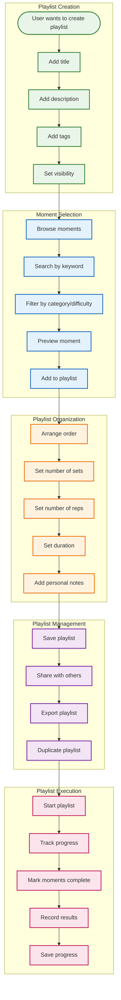

# Practika - Playlist Creation Flow

```mermaid
flowchart TD
    subgraph "Playlist Creation"
        START([User wants to create playlist])
        TITLE[Add title]
        DESCRIPTION[Add description]
        TAGS[Add tags]
        VISIBILITY[Set visibility]
    end

    subgraph "Moment Selection"
        BROWSE[Browse moments]
        SEARCH[Search by keyword]
        FILTER[Filter by category/difficulty]
        PREVIEW[Preview moment]
        SELECT[Add to playlist]
    end

    subgraph "Playlist Organization"
        ORDER[Arrange order]
        SETS[Set number of sets]
        REPS[Set number of reps]
        DURATION[Set duration]
        NOTES[Add personal notes]
    end

    subgraph "Playlist Management"
        SAVE[Save playlist]
        SHARE[Share with others]
        EXPORT[Export playlist]
        DUPLICATE[Duplicate playlist]
    end

    subgraph "Playlist Execution"
        START_PLAYLIST[Start playlist]
        TRACK_PROGRESS[Track progress]
        MARK_COMPLETE[Mark moments complete]
        RECORD_RESULTS[Record results]
        SAVE_PROGRESS[Save progress]
    end

    %% Flow connections
    START --> TITLE
    TITLE --> DESCRIPTION
    DESCRIPTION --> TAGS
    TAGS --> VISIBILITY
    VISIBILITY --> BROWSE

    BROWSE --> SEARCH
    SEARCH --> FILTER
    FILTER --> PREVIEW
    PREVIEW --> SELECT
    SELECT --> ORDER

    ORDER --> SETS
    SETS --> REPS
    REPS --> DURATION
    DURATION --> NOTES
    NOTES --> SAVE

    SAVE --> SHARE
    SHARE --> EXPORT
    EXPORT --> DUPLICATE
    DUPLICATE --> START_PLAYLIST

    START_PLAYLIST --> TRACK_PROGRESS
    TRACK_PROGRESS --> MARK_COMPLETE
    MARK_COMPLETE --> RECORD_RESULTS
    RECORD_RESULTS --> SAVE_PROGRESS

    %% Styling
    classDef creation fill:#e8f5e8,stroke:#2e7d32,stroke-width:2px
    classDef selection fill:#e3f2fd,stroke:#1565c0,stroke-width:2px
    classDef organization fill:#fff3e0,stroke:#ef6c00,stroke-width:2px
    classDef management fill:#f3e5f5,stroke:#7b1fa2,stroke-width:2px
    classDef execution fill:#fce4ec,stroke:#c2185b,stroke-width:2px

    class START,TITLE,DESCRIPTION,TAGS,VISIBILITY creation
    class BROWSE,SEARCH,FILTER,PREVIEW,SELECT selection
    class ORDER,SETS,REPS,DURATION,NOTES organization
    class SAVE,SHARE,EXPORT,DUPLICATE management
    class START_PLAYLIST,TRACK_PROGRESS,MARK_COMPLETE,RECORD_RESULTS,SAVE_PROGRESS execution
```
