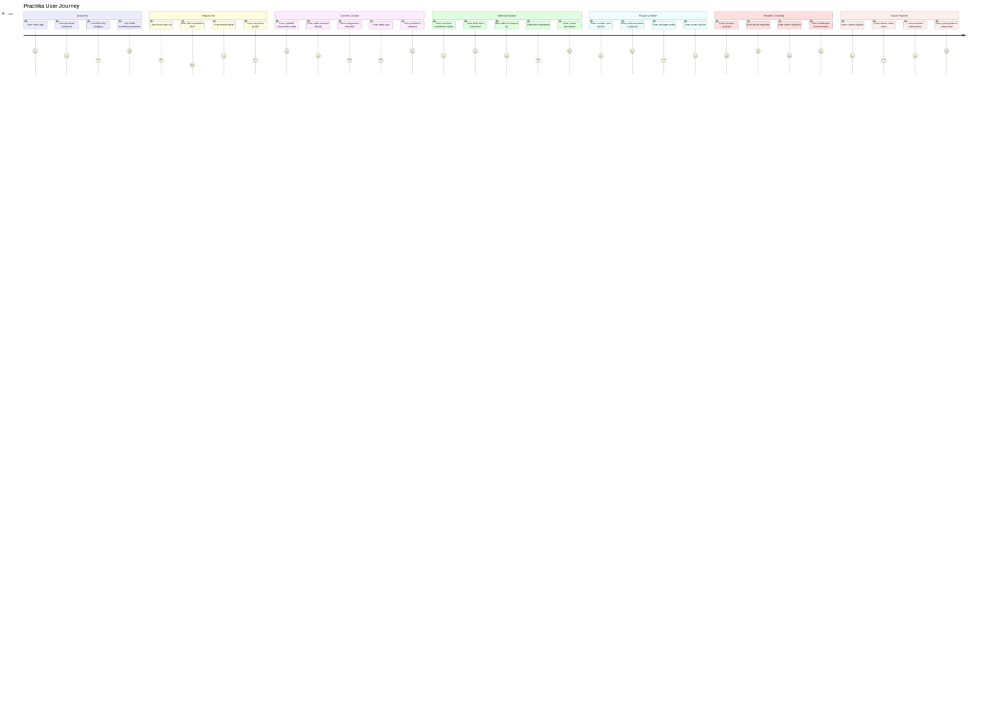

# Practika - User Journey Flow

```mermaid
journey
    title Practika User Journey
    section Discovery
      User visits app: 5: User
      User browses moments: 4: User
      User filters by category: 3: User
      User finds interesting moment: 5: User
    section Registration
      User clicks sign up: 3: User
      User fills registration form: 2: User
      User verifies email: 4: User
      User completes profile: 3: User
    section Content Creation
      User uploads movement video: 5: User
      User adds moment details: 4: User
      User categorizes moment: 3: User
      User adds tags: 3: User
      User publishes moment: 5: User
    section Video Annotation
      User watches movement video: 4: User
      User adds form correction: 5: User
      User adds technique tip: 4: User
      User sets timestamp: 3: User
      User saves annotation: 5: User
    section Playlist Creation
      User creates new playlist: 4: User
      User adds moments to playlist: 5: User
      User arranges order: 3: User
      User saves playlist: 4: User
    section Progress Tracking
      User records workout: 4: User
      User tracks progress: 5: User
      User views analytics: 4: User
      User celebrates achievements: 5: User
    section Social Features
      User shares playlist: 4: User
      User follows other users: 3: User
      User receives notifications: 4: User
      User participates in community: 5: User
```
