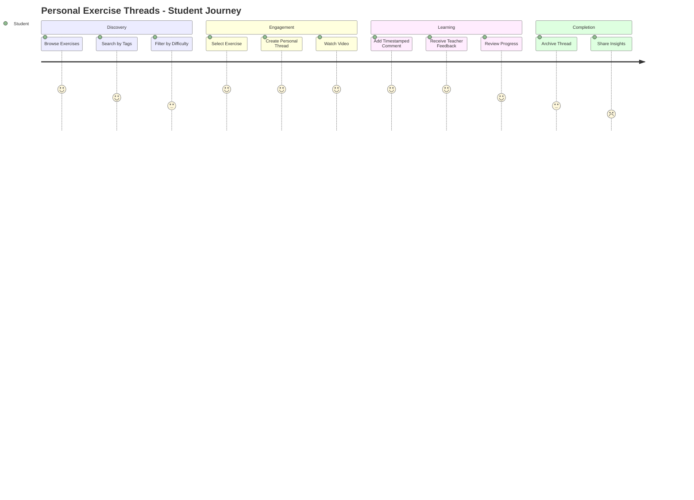
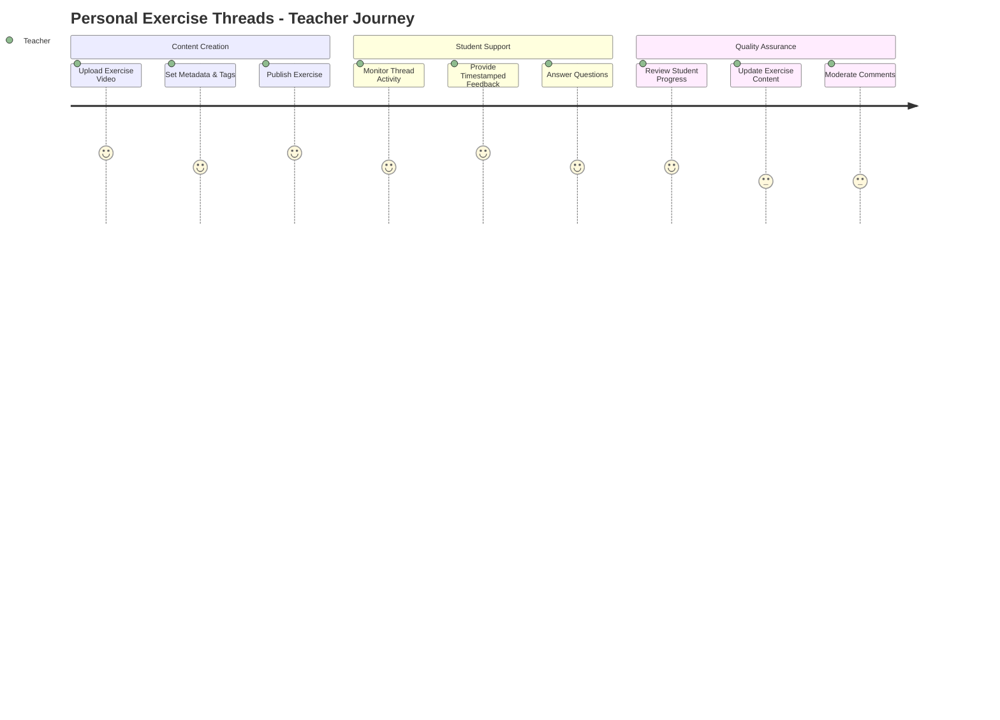
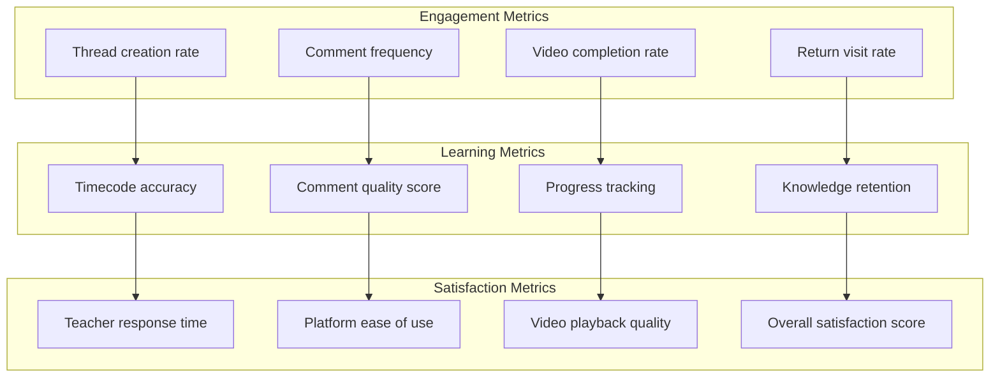
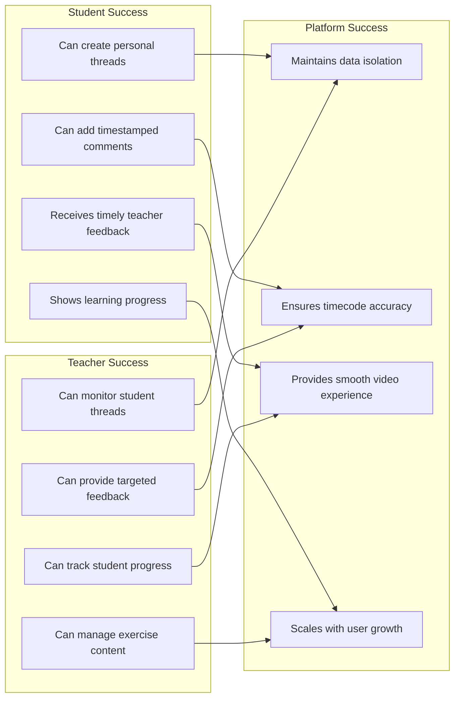
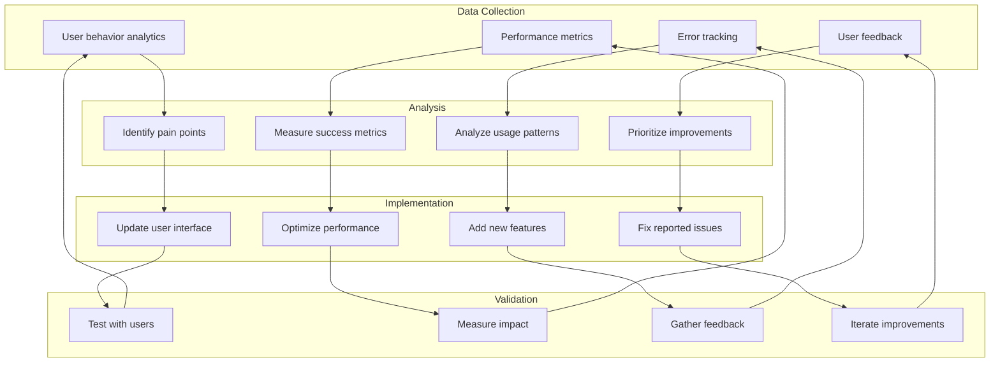

# User Journey Map

## User Journey Map

```mermaid
journey
    title Personal Exercise Threads - Student Journey
    section Discovery
      Browse Exercises: 5: Student
      Search by Tags: 4: Student
      Filter by Difficulty: 3: Student
    section Engagement
      Select Exercise: 5: Student
      Create Personal Thread: 5: Student
      Watch Video: 5: Student
    section Learning
      Add Timestamped Comment: 5: Student
      Receive Teacher Feedback: 5: Student
      Review Progress: 4: Student
    section Completion
      Archive Thread: 3: Student
      Share Insights: 2: Student
```

```mermaid
journey
    title Personal Exercise Threads - Teacher Journey
    section Content Creation
      Upload Exercise Video: 5: Teacher
      Set Metadata & Tags: 4: Teacher
      Publish Exercise: 5: Teacher
    section Student Support
      Monitor Thread Activity: 4: Teacher
      Provide Timestamped Feedback: 5: Teacher
      Answer Questions: 4: Teacher
    section Quality Assurance
      Review Student Progress: 4: Teacher
      Update Exercise Content: 3: Teacher
      Moderate Comments: 3: Teacher
```

## Core User Flows

```mermaid
flowchart TD
    subgraph "Exercise Discovery & Thread Creation"
        A[Student browses exercises] --> B[Select exercise of interest]
        B --> C[System creates Personal Exercise Thread]
        C --> D[Thread is private to student + author]
        D --> E[Student can now comment on video]
    end

    subgraph "Video Watching & Comment Creation"
        F[Student plays video] --> G[Pause at specific timestamp]
        G --> H[Add comment with timecode range]
        H --> I[System validates timecode bounds]
        I --> J[Comment saved to PET]
        J --> K[Teacher notified of new activity]
    end

    subgraph "Teacher Feedback & Response"
        L[Teacher reviews student thread] --> M[Watch video with student comments]
        M --> N[Add timestamped feedback]
        N --> O[System validates teacher permissions]
        O --> P[Feedback appears in student's PET]
        P --> Q[Student notified of teacher response]
    end
```

## Key User Experience Moments

```mermaid
graph LR
    subgraph "Discovery Phase"
        M1[First exercise discovery]
        M2[Personal thread creation]
        M3[Initial video interaction]
    end

    subgraph "Learning Phase"
        M4[First timestamped comment]
        M5[Receiving teacher feedback]
        M6[Understanding timecode system]
    end

    subgraph "Mastery Phase"
        M7[Confident comment creation]
        M8[Active thread engagement]
        M9[Progress tracking]
    end

    subgraph "Completion Phase"
        M10[Thread archival]
        M11[Knowledge retention]
        M12[Next exercise selection]
    end

    M1 --> M2 --> M3 --> M4 --> M5 --> M6 --> M7 --> M8 --> M9 --> M10 --> M11 --> M12
```

## User Satisfaction Metrics

```mermaid
graph TB
    subgraph "Engagement Metrics"
        EM1[Thread creation rate]
        EM2[Comment frequency]
        EM3[Video completion rate]
        EM4[Return visit rate]
    end

    subgraph "Learning Metrics"
        LM1[Timecode accuracy]
        LM2[Comment quality score]
        LM3[Progress tracking]
        LM4[Knowledge retention]
    end

    subgraph "Satisfaction Metrics"
        SM1[Teacher response time]
        SM2[Platform ease of use]
        SM3[Video playback quality]
        SM4[Overall satisfaction score]
    end

    EM1 --> LM1
    EM2 --> LM2
    EM3 --> LM3
    EM4 --> LM4
    LM1 --> SM1
    LM2 --> SM2
    LM3 --> SM3
    LM4 --> SM4
```

## Success Criteria

```mermaid
flowchart LR
    subgraph "Student Success"
        SS1[Can create personal threads]
        SS2[Can add timestamped comments]
        SS3[Receives timely teacher feedback]
        SS4[Shows learning progress]
    end

    subgraph "Teacher Success"
        TS1[Can monitor student threads]
        TS2[Can provide targeted feedback]
        TS3[Can track student progress]
        TS4[Can manage exercise content]
    end

    subgraph "Platform Success"
        PS1[Maintains data isolation]
        PS2[Ensures timecode accuracy]
        PS3[Provides smooth video experience]
        PS4[Scales with user growth]
    end

    SS1 --> PS1
    SS2 --> PS2
    SS3 --> PS3
    SS4 --> PS4
    TS1 --> PS1
    TS2 --> PS2
    TS3 --> PS3
    TS4 --> PS4
```

## Continuous Improvement Loop

```mermaid
graph TD
    subgraph "Data Collection"
        DC1[User behavior analytics]
        DC2[Performance metrics]
        DC3[Error tracking]
        DC4[User feedback]
    end

    subgraph "Analysis"
        AN1[Identify pain points]
        AN2[Measure success metrics]
        AN3[Analyze usage patterns]
        AN4[Prioritize improvements]
    end

    subgraph "Implementation"
        IM1[Update user interface]
        IM2[Optimize performance]
        IM3[Add new features]
        IM4[Fix reported issues]
    end

    subgraph "Validation"
        VA1[Test with users]
        VA2[Measure impact]
        VA3[Gather feedback]
        VA4[Iterate improvements]
    end

    DC1 --> AN1 --> IM1 --> VA1 --> DC1
    DC2 --> AN2 --> IM2 --> VA2 --> DC2
    DC3 --> AN3 --> IM3 --> VA3 --> DC3
    DC4 --> AN4 --> IM4 --> VA4 --> DC4
```
