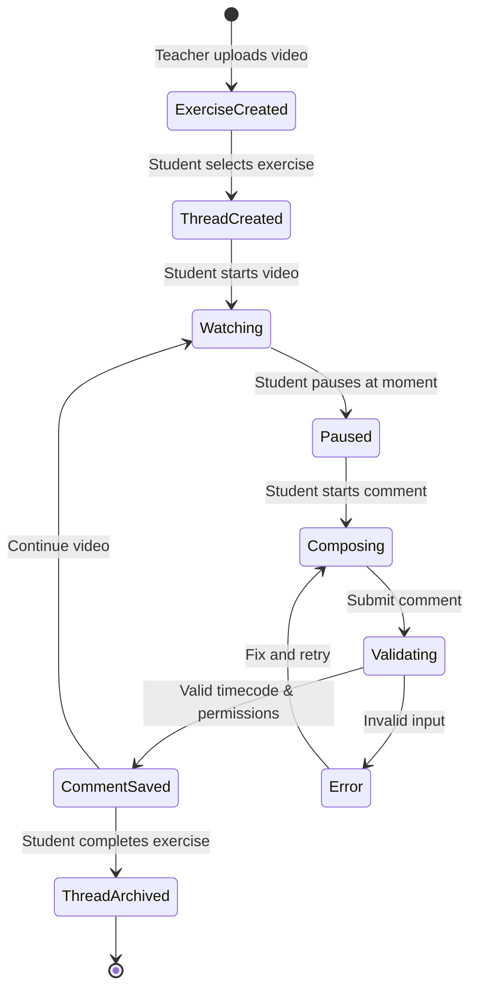
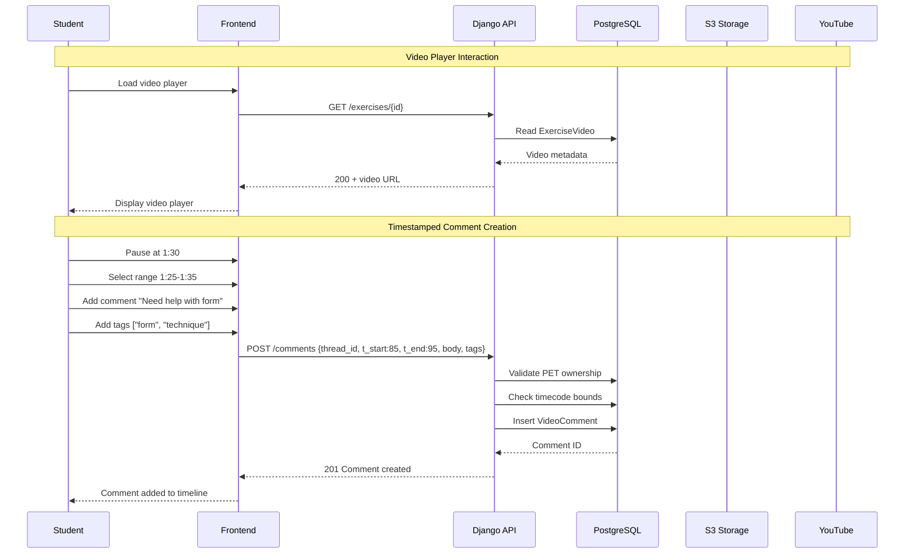
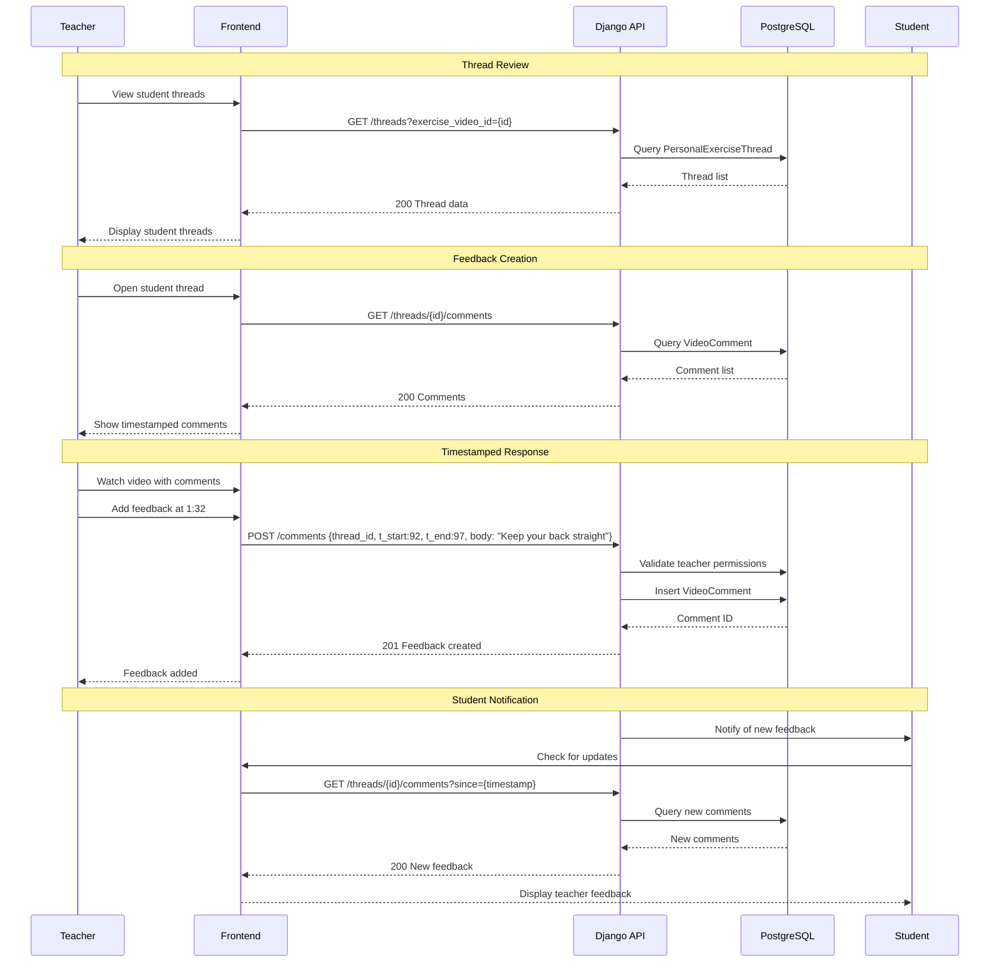
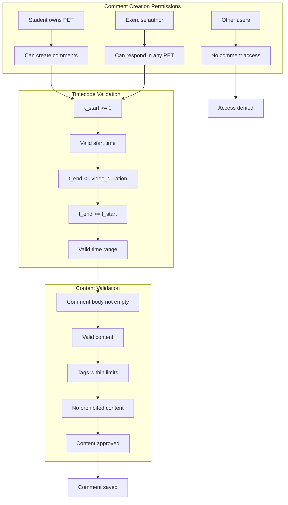
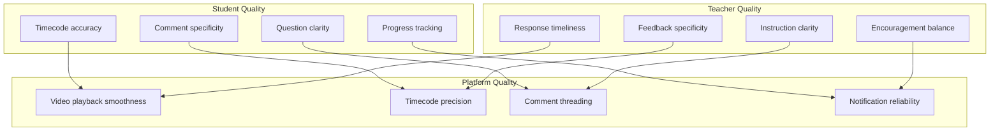
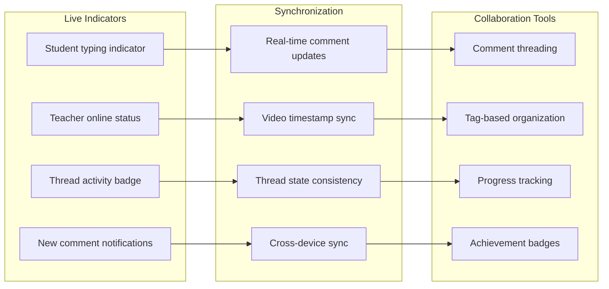
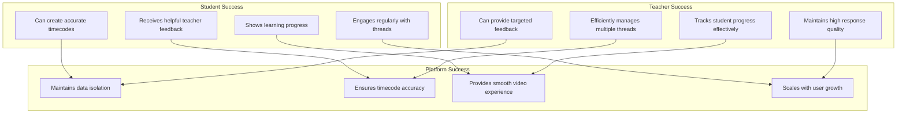

# Video Annotation Flow

## Core Annotation Flow

```mermaid
flowchart TD
    subgraph "Exercise Creation"
        A[Teacher uploads video] --> B[System creates ExerciseVideo]
        B --> C[Set metadata & tags]
        C --> D[Publish exercise]
        D --> E[Exercise available to students]
    end

    subgraph "Personal Thread Creation"
        F[Student discovers exercise] --> G[Select exercise]
        G --> H[System creates PersonalExerciseThread]
        H --> I[Thread private to student + author]
        I --> J[Ready for annotation]
    end

    subgraph "Timestamped Comment Creation"
        K[Student plays video] --> L[Pause at specific moment]
        L --> M[Select timecode range]
        M --> N[Add comment text]
        N --> O[Add tags]
        O --> P[Submit comment]
        P --> Q[System validates timecode]
        Q --> R[Comment saved to PET]
    end
```



## Annotation Workflow States



## Detailed Annotation Process



## Teacher Feedback Process



## Annotation Types & Categories

```mermaid
graph LR
    subgraph "Student Annotations"
        SA1[Questions<br/>"How do I...?"]
        SA2[Confusion<br/>"I don't understand..."]
        SA3[Progress<br/>"I think I got it!"]
        SA4[Practice<br/>"Working on this part"]
    end

    subgraph "Teacher Annotations"
        TA1[Correction<br/>"Fix your form here"]
        TA2[Encouragement<br/>"Great progress!"]
        TA3[Explanation<br/>"This works because..."]
        TA4[Next Steps<br/>"Now try..."]
    end

    subgraph "Annotation Categories"
        AC1[Form & Technique]
        AC2[Timing & Rhythm]
        AC3[Strength & Power]
        AC4[Flexibility & Range]
        AC5[Safety & Injury Prevention]
    end

    SA1 --> AC1
    SA2 --> AC2
    SA3 --> AC3
    SA4 --> AC4
    TA1 --> AC1
    TA2 --> AC3
    TA3 --> AC2
    TA4 --> AC5
```

## Permission & Access Control



## Annotation Quality Metrics



## Real-time Collaboration Features



## Success Criteria


