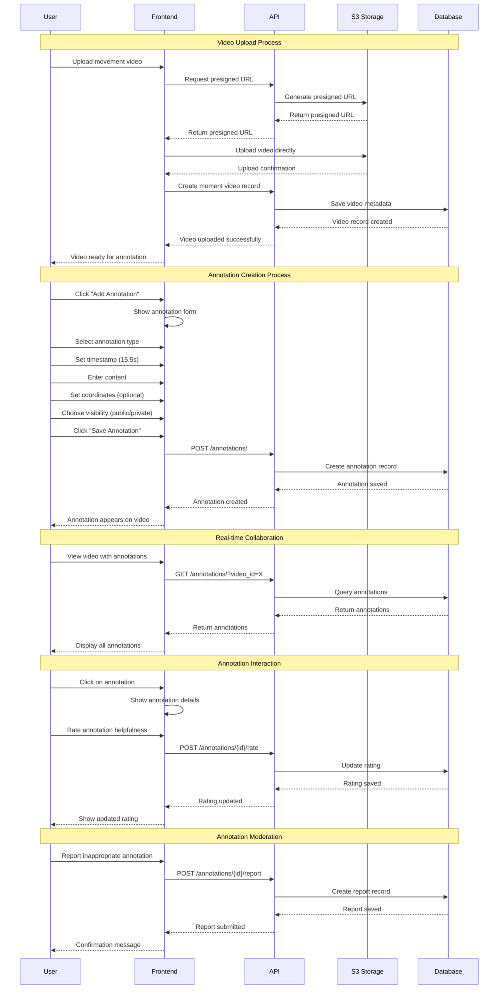

# Practika - Video Annotation Flow

```mermaid
sequenceDiagram
    participant U as User
    participant F as Frontend
    participant A as API
    participant S3 as S3 Storage
    participant DB as Database

    Note over U,DB: Video Upload Process
    U->>F: Upload movement video
    F->>A: Request presigned URL
    A->>S3: Generate presigned URL
    S3-->>A: Return presigned URL
    A-->>F: Return presigned URL
    F->>S3: Upload video directly
    S3-->>F: Upload confirmation
    F->>A: Create moment video record
    A->>DB: Save video metadata
    DB-->>A: Video record created
    A-->>F: Video uploaded successfully
    F-->>U: Video ready for annotation

    Note over U,DB: Annotation Creation Process
    U->>F: Click "Add Annotation"
    F->>F: Show annotation form
    U->>F: Select annotation type
    U->>F: Set timestamp (15.5s)
    U->>F: Enter content
    U->>F: Set coordinates (optional)
    U->>F: Choose visibility (public/private)
    U->>F: Click "Save Annotation"
    F->>A: POST /annotations/
    A->>DB: Create annotation record
    DB-->>A: Annotation saved
    A-->>F: Annotation created
    F-->>U: Annotation appears on video

    Note over U,DB: Real-time Collaboration
    U->>F: View video with annotations
    F->>A: GET /annotations/?video_id=X
    A->>DB: Query annotations
    DB-->>A: Return annotations
    A-->>F: Return annotations
    F-->>U: Display all annotations

    Note over U,DB: Annotation Interaction
    U->>F: Click on annotation
    F->>F: Show annotation details
    U->>F: Rate annotation helpfulness
    F->>A: POST /annotations/{id}/rate
    A->>DB: Update rating
    DB-->>A: Rating saved
    A-->>F: Rating updated
    F-->>U: Show updated rating

    Note over U,DB: Annotation Moderation
    U->>F: Report inappropriate annotation
    F->>A: POST /annotations/{id}/report
    A->>DB: Create report record
    DB-->>A: Report saved
    A-->>F: Report submitted
    F-->>U: Confirmation message
```
