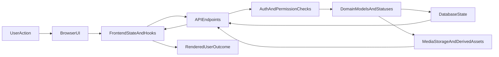
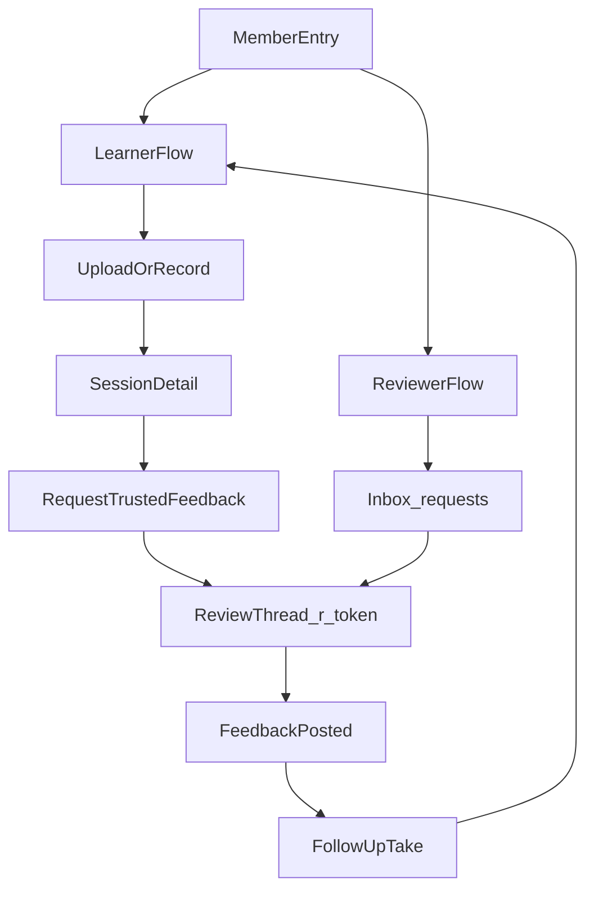

# Practica Role Path Story Map

Status: Implemented-only canonical reference  
Last verified against: `apps/frontend/src/routing.js`, `apps/backend/practica/urls.py`, `apps/backend/videos/models.py`, `apps/backend/videos/reviews/queries.py`, `apps/backend/videos/reviews/services.py`, `apps/backend/videos/serializers.py`

## Purpose

This document is the canonical map of:

- who the users are in Practica,
- which routes and paths they use,
- which stories those paths satisfy,
- how data moves through the system,
- and how to reproduce and verify each core flow.

This document describes only implemented behavior.

## Role Glossary

- `member`: any authenticated account.
- `learner` / `session owner` / `student` / `creator`: the member who owns the session and archive artifact (`creator` is an API alias for owner-side filters/fields).
- `reviewer`: a trusted member who is assigned to review requests and can respond with feedback.
- `teacher`: workflow-context label represented through reviewer behavior; not a separate account type.

## Data Model: What Is The Data

### Identity data

- auth credentials and token session state (`/api/auth/login/`, `/api/auth/register/`, `/api/auth/me/`)
- member profile identity used in route access and response payloads

### Practice artifact data

- `Session` record (title, metadata, owner, processing status)
- media object references and derived playback assets
- practice thread grouping via `practice_series`

### Collaboration data

- `ReviewLink` token and expiration state
- `ReviewRequest` workflow record (`student`, `reviewer`, `status`, review metadata)
- `ReviewVideoFeedback` artifacts attached to the review thread
- `ReviewerRosterMembership` relationship for designated reviewer constraints

### Operational data

- review status transition timestamps (`opened_at`, `responded_at`, `viewed_at`, `resubmitted_at`, `closed_at`)
- `ReviewRequestEvent` transition/event stream
- session last seen and inbox/read indicators

## System Boundaries

- Browser UI and route state in the SPA.
- Frontend app state and hooks coordinating requests and local rendering state.
- API layer in Django/DRF endpoints.
- Authorization and transition logic in review query/service layer.
- Durable persistence in relational models and media storage/processing pipeline.

## Route Map By Role

### Learner routes

- `/`, `/archive`, `/calendar`, `/library` -> calendar/archive surface
- `/upload` -> upload flow
- `/record`, `/recording` -> recorder flow
- `/series/:seriesName` -> practice thread view
- `/sessions/:id` -> session detail orchestration
- `/r/:token` -> review thread participation

### Reviewer routes

- `/requests` -> reviewer inbox/workspace
- `/r/:token` -> review thread response surface

### Shared/public route

- `/privacy` -> public policy page

## Primary Stories By Role

### Learner stories

- As a learner, I can upload or record a private take.
- As a learner, I can review my own takes over time in my archive and threads.
- As a learner, I can request trusted feedback from a designated reviewer.
- As a learner, I can review responses and continue with a follow-up take.

### Reviewer stories

- As a reviewer, I can see pending requests in an inbox.
- As a reviewer, I can open a private review thread and respond with feedback.
- As a reviewer, I can update request state when a resubmission or moderation outcome is needed.

### Teacher-context story

- As a teacher (workflow context), I can run repeated async review cycles without requiring a separate LMS role model.

## End-To-End Data Flow

### Where Data Starts

- A user action in UI routes (`/upload`, `/record`, `/sessions/:id`, `/requests`, `/r/:token`) creates or mutates domain records.
- Sign-in bootstrap starts at auth endpoints and resolves identity with `/api/auth/me/`.

### How Data Flows

1. User action occurs in browser route surface.
2. Frontend hook/action prepares payload and calls API.
3. API endpoint authenticates user and validates payload.
4. Service/query layer enforces permissions and valid status transitions.
5. Model/storage writes occur (DB rows, media references, link activation).
6. API response returns canonical state for current user.
7. Frontend refreshes route-level state and renders the resulting UI state.

Media path includes asynchronous processing between upload completion and playback-ready status.

### Where Data Ends

- Durable artifact state ends in DB-backed session/review entities plus media storage.
- User-visible terminal states end at:
  - playback-ready session in detail/archive views,
  - review request in responded/viewed/closed-like outcomes,
  - follow-up loop continuation with a new session/request.

## Core Role Paths (Reproducible)

### Path A: Learner creates a take and requests review

Start:

- authenticated learner at `/upload` or `/record`

Route path:

- `/upload` or `/record` -> `/sessions/:id` -> optional `/r/:token`

API path (representative):

- session create/upload endpoints under `/api/sessions/...`
- `POST /api/review-requests/` to create structured request
- `GET /api/review/:token/` to open thread context

Primary data created/changed:

- `Session` (owner-scoped artifact)
- `ReviewRequest` (`status=requested`)
- `ReviewLink` token record
- optional `ReviewerInvite`/roster relationship side effects

Expected end state:

- session is visible to owner
- request appears in reviewer inbox scope
- review thread token resolves for authorized users

### Path B: Reviewer opens inbox and responds

Start:

- authenticated reviewer at `/requests`

Route path:

- `/requests` -> `/r/:token`

API path (representative):

- `GET /api/inbox/` (or reviewer alias inbox endpoint)
- `GET /api/review/:token/`
- `POST /api/review/:token/feedback/`

Primary data created/changed:

- request can transition to `opened`
- feedback artifacts attached to the request thread
- request can transition to `responded`

Expected end state:

- feedback is visible in thread for both participants
- learner can mark reviewed state from responded request

### Path C: Learner views response and continues loop

Start:

- learner opens `/r/:token` or session detail after reviewer response

Route path:

- `/r/:token` -> `/sessions/:id` -> `/upload` or `/record` for next take

API path (representative):

- `POST /api/review-requests/{id}/mark-viewed/`
- optional `PATCH /api/review-requests/{id}/` for transitions like `resubmitted`/`closed`
- session create/upload endpoints for follow-up take

Primary data created/changed:

- `ReviewRequest.status` can move to `viewed`
- follow-up request can be created with parent linkage
- new `Session` created for continued cycle

Expected end state:

- prior request lifecycle is captured in events/timestamps
- next take continues `submission -> feedback -> follow-up` loop

## Permissions Matrix (Implemented)

- Session and review-request visibility is private by default.
- Review request visibility: student, reviewer, or staff.
- Reviewer response authority: assigned reviewer or staff.
- Owner-side request filters support `student`, `owner`, and `creator` aliases for the same actor scope.
- Student-specific actions include revoke/resubmit where transition rules allow.
- Both student and reviewer can close request where transition rules allow.

## Transition And Failure Notes

- Request transitions are constrained by allowed transition map in service layer.
- Invalid transitions return validation errors and preserve prior state.
- Non-authorized actors are blocked by permission checks.
- Review-link lifecycle can be deactivated/revoked as part of workflow changes.
- Playback readiness gates request creation for session-linked workflows.

## Data Boundary Diagram

## Flow Overview

## Reproducibility Checklist

Use this checklist when verifying docs or behavior drift:

1. Confirm route map still matches `apps/frontend/src/routing.js`.
2. Confirm API route inventory still matches `apps/backend/practica/urls.py`.
3. Confirm role aliases and serialized role labels still match `apps/backend/videos/models.py` and `apps/backend/videos/serializers.py`.
4. Confirm visibility and response permission semantics still match `apps/backend/videos/reviews/queries.py`.
5. Confirm status transitions and actor constraints still match `apps/backend/videos/reviews/services.py`.

If any item changes, update this document and `docs/README.md` in the same change set.
