# Practika - Business & Product WBS: Strategy & Growth

*"The goal is to be the best in the world at what you do." - Elon Musk*

## 🎯 Business & Product Work Breakdown Structure

This document breaks down the business strategy, product development, and growth initiatives into detailed work packages.

```mermaid
graph TB
    subgraph "🎯 BUSINESS MISSION"
        BUSINESS_MISSION[Revolutionize movement learning<br/>and create a global community]
    end

    subgraph "📊 MARKET ANALYSIS & STRATEGY"
        subgraph "Market Research"
            MR_TARGET_AUDIENCE[Target Audience Analysis<br/>Fitness Enthusiasts, Athletes]
            MR_COMPETITIVE[Competitive Analysis<br/>YouTube, Instagram, TikTok]
            MR_MARKET_SIZE[Market Size Assessment<br/>Global Fitness Market]
            MR_TRENDS[Industry Trends<br/>Digital Fitness, Remote Learning]
        end

        subgraph "Business Model"
            BM_FREEMIUM[Freemium Model<br/>Free + Premium Features]
            BM_SUBSCRIPTION[Subscription Tiers<br/>Monthly/Annual Plans]
            BM_MARKETPLACE[Marketplace Revenue<br/>Creator Monetization]
            BM_ENTERPRISE[Enterprise Solutions<br/>Gyms, Trainers, Schools]
        end

        subgraph "Value Proposition"
            VP_LEARNING[Enhanced Learning<br/>Interactive Annotations]
            VP_COMMUNITY[Community Building<br/>Global Network]
            VP_TECHNOLOGY[Advanced Technology<br/>AI-Powered Insights]
            VP_ACCESSIBILITY[Accessibility<br/>Learn Anywhere, Anytime]
        end
    end

    subgraph "🚀 PRODUCT STRATEGY"
        subgraph "Product Vision"
            PV_CORE[Core Product Vision<br/>Movement Learning Platform]
            PV_ROADMAP[Product Roadmap<br/>3-Year Development Plan]
            PV_FEATURES[Feature Prioritization<br/>Must-Have vs Nice-to-Have]
            PV_METRICS[Success Metrics<br/>KPIs and OKRs]
        end

        subgraph "User Research"
            UR_INTERVIEWS[User Interviews<br/>Qualitative Insights]
            UR_SURVEYS[User Surveys<br/>Quantitative Data]
            UR_USABILITY[Usability Testing<br/>Feature Validation]
            UR_ANALYTICS[Analytics Analysis<br/>Behavior Patterns]
        end

        subgraph "Product Development"
            PD_AGILE[Agile Development<br/>Sprint Planning]
            PD_PRIORITIZATION[Feature Prioritization<br/>RICE Framework]
            PD_TESTING[Product Testing<br/>Beta Programs]
            PD_ITERATION[Continuous Iteration<br/>User Feedback Loop]
        end
    end

    subgraph "👥 USER ACQUISITION & GROWTH"
        subgraph "Marketing Strategy"
            MS_CONTENT[Content Marketing<br/>Educational Content]
            MS_SOCIAL[Social Media Marketing<br/>Instagram, TikTok, YouTube]
            MS_INFLUENCER[Influencer Partnerships<br/>Fitness Influencers]
            MS_SEO[Search Engine Optimization<br/>Organic Growth]
        end

        subgraph "User Acquisition"
            UA_PAID[Paid Advertising<br/>Google Ads, Facebook Ads]
            UA_REFERRAL[Referral Program<br/>User-to-User Growth]
            UA_PARTNERSHIPS[Strategic Partnerships<br/>Gyms, Trainers]
            UA_EVENTS[Event Marketing<br/>Fitness Events, Conferences]
        end

        subgraph "Community Building"
            CB_ONLINE[Online Community<br/>Forums, Groups]
            CB_OFFLINE[Offline Events<br/>Meetups, Workshops]
            CB_CONTENT[User-Generated Content<br/>Community Challenges]
            CB_MODERATION[Community Moderation<br/>Quality Control]
        end
    end

    subgraph "💰 MONETIZATION & REVENUE"
        subgraph "Revenue Streams"
            RS_SUBSCRIPTION[Subscription Revenue<br/>Premium Features]
            RS_ADS[Advertising Revenue<br/>Sponsored Content]
            RS_MARKETPLACE[Marketplace Commission<br/>Creator Revenue Share]
            RS_ENTERPRISE[Enterprise Sales<br/>B2B Solutions]
        end

        subgraph "Pricing Strategy"
            PS_FREE[Free Tier<br/>Basic Features]
            PS_PREMIUM[Premium Tier<br/>Advanced Features]
            PS_PRO[Pro Tier<br/>Professional Tools]
            PS_ENTERPRISE[Enterprise Tier<br/>Custom Solutions]
        end

        subgraph "Payment Processing"
            PP_STRIPE[Stripe Integration<br/>Payment Processing]
            PP_SUBSCRIPTION[Subscription Management<br/>Billing Automation]
            PP_REFUNDS[Refund Policy<br/>Customer Service]
            PP_TAXES[Tax Compliance<br/>Multi-Region Support]
        end
    end

    subgraph "📈 SCALING & OPERATIONS"
        subgraph "Team Building"
            TB_HIRING[Hiring Strategy<br/>Key Roles & Skills]
            TB_CULTURE[Company Culture<br/>Values & Mission]
            TB_LEADERSHIP[Leadership Development<br/>Management Training]
            TB_RETENTION[Employee Retention<br/>Benefits & Growth]
        end

        subgraph "Operational Excellence"
            OE_PROCESSES[Process Optimization<br/>Efficiency Improvements]
            OE_AUTOMATION[Automation Strategy<br/>Reduce Manual Work]
            OE_QUALITY[Quality Assurance<br/>Product Excellence]
            OE_CUSTOMER[Customer Success<br/>Support & Onboarding]
        end

        subgraph "International Expansion"
            IE_LOCALIZATION[Localization Strategy<br/>Multi-Language Support]
            IE_REGULATIONS[Regulatory Compliance<br/>GDPR, CCPA]
            IE_PARTNERSHIPS[Local Partnerships<br/>Regional Expansion]
            IE_CULTURE[Cultural Adaptation<br/>Market-Specific Features]
        end
    end

    subgraph "🔒 COMPLIANCE & LEGAL"
        subgraph "Legal Framework"
            LF_TERMS[Terms of Service<br/>User Agreements]
            LF_PRIVACY[Privacy Policy<br/>Data Protection]
            LF_COPYRIGHT[Copyright Protection<br/>Content Rights]
            LF_LICENSING[Licensing Agreements<br/>Third-Party Content]
        end

        subgraph "Data Protection"
            DP_GDPR[GDPR Compliance<br/>European Regulations]
            DP_CCPA[CCPA Compliance<br/>California Privacy]
            DP_ENCRYPTION[Data Encryption<br/>Security Standards]
            DP_AUDIT[Security Audits<br/>Regular Assessments]
        end

        subgraph "Content Moderation"
            CM_GUIDELINES[Community Guidelines<br/>Content Standards]
            CM_MODERATION[Moderation Tools<br/>AI + Human Review]
            CM_REPORTING[Reporting System<br/>User Complaints]
            CM_ENFORCEMENT[Policy Enforcement<br/>Violation Handling]
        end
    end

    %% Business dependencies
    BUSINESS_MISSION --> MR_TARGET_AUDIENCE
    BUSINESS_MISSION --> PV_CORE
    BUSINESS_MISSION --> MS_CONTENT
    BUSINESS_MISSION --> RS_SUBSCRIPTION

    %% Market dependencies
    MR_TARGET_AUDIENCE --> BM_FREEMIUM
    BM_FREEMIUM --> PS_FREE
    PS_FREE --> UA_PAID

    %% Product dependencies
    PV_CORE --> PD_AGILE
    PD_AGILE --> UR_INTERVIEWS
    UR_INTERVIEWS --> PD_ITERATION

    %% Growth dependencies
    MS_CONTENT --> CB_ONLINE
    CB_ONLINE --> CB_MODERATION
    CB_MODERATION --> CM_GUIDELINES

    %% Revenue dependencies
    RS_SUBSCRIPTION --> PP_STRIPE
    PP_STRIPE --> PP_TAXES
    PP_TAXES --> DP_GDPR

    %% Operations dependencies
    TB_HIRING --> OE_PROCESSES
    OE_PROCESSES --> IE_LOCALIZATION
    IE_LOCALIZATION --> LF_TERMS

    %% Styling
    classDef mission fill:#ff6b6b,stroke:#c92a2a,stroke-width:3px,color:#fff
    classDef market fill:#4ecdc4,stroke:#087f23,stroke-width:2px
    classDef product fill:#45b7d1,stroke:#0c4a6e,stroke-width:2px
    classDef growth fill:#96ceb4,stroke:#166534,stroke-width:2px
    classDef revenue fill:#feca57,stroke:#92400e,stroke-width:2px
    classDef operations fill:#ff9ff3,stroke:#831843,stroke-width:2px
    classDef legal fill:#a8e6cf,stroke:#2d5a3d,stroke-width:2px

    class BUSINESS_MISSION mission
    class MR_TARGET_AUDIENCE,MR_COMPETITIVE,MR_MARKET_SIZE,MR_TRENDS,BM_FREEMIUM,BM_SUBSCRIPTION,BM_MARKETPLACE,BM_ENTERPRISE,VP_LEARNING,VP_COMMUNITY,VP_TECHNOLOGY,VP_ACCESSIBILITY market
    class PV_CORE,PV_ROADMAP,PV_FEATURES,PV_METRICS,UR_INTERVIEWS,UR_SURVEYS,UR_USABILITY,UR_ANALYTICS,PD_AGILE,PD_PRIORITIZATION,PD_TESTING,PD_ITERATION product
    class MS_CONTENT,MS_SOCIAL,MS_INFLUENCER,MS_SEO,UA_PAID,UA_REFERRAL,UA_PARTNERSHIPS,UA_EVENTS,CB_ONLINE,CB_OFFLINE,CB_CONTENT,CB_MODERATION growth
    class RS_SUBSCRIPTION,RS_ADS,RS_MARKETPLACE,RS_ENTERPRISE,PS_FREE,PS_PREMIUM,PS_PRO,PS_ENTERPRISE,PP_STRIPE,PP_SUBSCRIPTION,PP_REFUNDS,PP_TAXES revenue
    class TB_HIRING,TB_CULTURE,TB_LEADERSHIP,TB_RETENTION,OE_PROCESSES,OE_AUTOMATION,OE_QUALITY,OE_CUSTOMER,IE_LOCALIZATION,IE_REGULATIONS,IE_PARTNERSHIPS,IE_CULTURE operations
    class LF_TERMS,LF_PRIVACY,LF_COPYRIGHT,LF_LICENSING,DP_GDPR,DP_CCPA,DP_ENCRYPTION,DP_AUDIT,CM_GUIDELINES,CM_MODERATION,CM_REPORTING,CM_ENFORCEMENT legal
```

## 🎯 Business Strategy Overview

### **Market Opportunity**
- **Global Fitness Market**: $96.3 billion (2022), growing at 4.6% CAGR
- **Digital Fitness**: Accelerated by COVID-19, 33% of users prefer digital solutions
- **Content Creation**: 500+ million fitness videos uploaded annually
- **Learning Gap**: Traditional video platforms lack interactive learning features

### **Competitive Advantage**
- **Interactive Annotations**: First-mover advantage in collaborative video learning
- **AI-Powered Insights**: Machine learning for personalized recommendations
- **Community-Driven**: User-generated content with quality curation
- **Technical Excellence**: Scalable, real-time platform architecture

### **Target Market Segments**
1. **Fitness Enthusiasts** (40%): Active learners seeking improvement
2. **Athletes & Coaches** (25%): Professional training and coaching
3. **Beginners** (20%): New to fitness, need guidance
4. **Content Creators** (15%): Fitness influencers and educators

## 📊 Business Metrics & KPIs

### **User Growth Metrics**
- **Monthly Active Users (MAU)**: Target 100K by Year 1
- **Daily Active Users (DAU)**: Target 15K by Year 1
- **User Retention**: 70% monthly retention rate
- **Viral Coefficient**: Target 1.2+ viral coefficient

### **Revenue Metrics**
- **Monthly Recurring Revenue (MRR)**: Target $50K by Year 1
- **Annual Recurring Revenue (ARR)**: Target $600K by Year 2
- **Customer Lifetime Value (CLV)**: Target $200 per user
- **Customer Acquisition Cost (CAC)**: Target < $50 per user

### **Engagement Metrics**
- **Session Duration**: 15+ minutes average
- **Videos Watched**: 10+ videos per session
- **Annotations Created**: 5+ annotations per user
- **Community Participation**: 30% user participation rate

## 🚀 Go-to-Market Strategy

### **Phase 1: MVP Launch (Months 1-3)**
- **Target**: Early adopters and fitness enthusiasts
- **Channels**: Product Hunt, Reddit, fitness forums
- **Goal**: 1,000 beta users, validate core features
- **Metrics**: User feedback, feature usage, retention

### **Phase 2: Community Building (Months 4-6)**
- **Target**: Content creators and influencers
- **Channels**: Social media, influencer partnerships
- **Goal**: 10,000 users, establish community
- **Metrics**: User-generated content, community engagement

### **Phase 3: Market Expansion (Months 7-12)**
- **Target**: Broader fitness market
- **Channels**: Paid advertising, partnerships
- **Goal**: 50,000 users, monetization
- **Metrics**: Revenue growth, user acquisition cost

### **Phase 4: Scale & International (Months 13-24)**
- **Target**: International markets
- **Channels**: Local partnerships, localized marketing
- **Goal**: 100,000+ users, multiple markets
- **Metrics**: International growth, market penetration

## 💰 Revenue Model & Pricing

### **Freemium Model**
- **Free Tier**: Basic video watching, limited annotations
- **Premium ($9.99/month)**: Unlimited annotations, advanced features
- **Pro ($19.99/month)**: Creator tools, analytics, priority support
- **Enterprise ($99/month)**: Custom solutions, white-label options

### **Additional Revenue Streams**
- **Marketplace Commission**: 10% on creator monetization
- **Advertising**: Sponsored content, premium placements
- **Enterprise Sales**: Custom solutions for gyms and trainers
- **Data Insights**: Aggregated analytics for industry partners

## 🏢 Team Structure & Hiring Plan

### **Year 1 Team (10-15 people)**
- **Engineering**: 6-8 developers (frontend, backend, DevOps)
- **Product**: 2-3 product managers, designers
- **Marketing**: 2-3 growth marketers, content creators
- **Operations**: 1-2 customer success, operations

### **Year 2 Team (25-30 people)**
- **Engineering**: 12-15 developers (mobile, AI, infrastructure)
- **Product**: 4-5 product managers, designers, researchers
- **Marketing**: 5-6 marketers (growth, content, partnerships)
- **Operations**: 3-4 customer success, sales, legal

### **Key Hiring Priorities**
1. **Senior Backend Engineer**: Scale the platform
2. **Product Designer**: User experience excellence
3. **Growth Marketing Manager**: User acquisition
4. **Customer Success Manager**: User retention

## 🔒 Legal & Compliance Strategy

### **Data Protection**
- **GDPR Compliance**: European user data protection
- **CCPA Compliance**: California privacy regulations
- **Data Encryption**: End-to-end encryption for sensitive data
- **Regular Audits**: Annual security and privacy audits

### **Content Moderation**
- **Community Guidelines**: Clear content standards
- **AI Moderation**: Automated content filtering
- **Human Review**: Manual review for flagged content
- **Appeal Process**: Fair appeal system for content decisions

### **Intellectual Property**
- **Copyright Protection**: DMCA compliance and takedown procedures
- **User Content Rights**: Clear ownership and licensing terms
- **Trademark Protection**: Brand protection and enforcement
- **Patent Strategy**: Protect core technology innovations

---

*"The first step is to establish that something is possible; then probability will occur." - Elon Musk*
