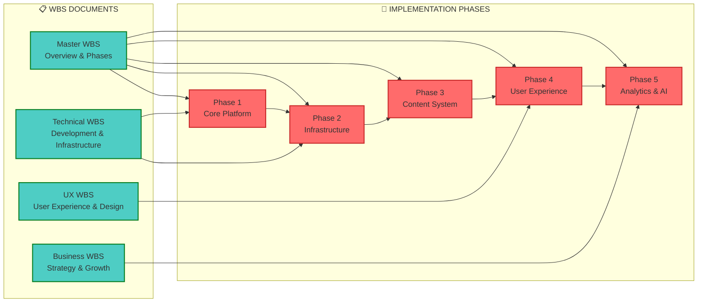

# Practika - WBS Index & Navigation

*"The best way to predict the future is to invent it." - Alan Kay*

## 📋 Work Breakdown Structure (WBS) Documentation Index

This index provides quick navigation to all WBS documents created for the Practika platform, designed with Elon Musk's approach to first principles thinking and ambitious execution.

## 📁 Documentation Organization

The Practika documentation has been reorganized into logical subdirectories for better navigation:

```
docs/
├── 📄 README.md                    # Main documentation index
├── 📁 wbs/                         # Work Breakdown Structure (this directory)
│   ├── 📄 wbs-index.md            # This file - WBS navigation
│   ├── 📄 wbs-master-overview.md   # Master project breakdown
│   ├── 📄 wbs-technical-implementation.md # Technical development
│   ├── 📄 wbs-user-experience.md  # UX design and features
│   └── 📄 wbs-business-strategy.md # Business model and growth
├── 📁 architecture/               # System architecture
├── 📁 flows/                       # User flows and processes
├── 📁 database/                    # Database design
└── 📁 api/                         # API documentation
```

For complete documentation navigation, see the [Main Documentation Index](../README.md).

## 🎯 WBS Document Overview

### **Master WBS Documents**
1. **[Master WBS Overview](wbs-master-overview.md)** - High-level project breakdown and phase planning
2. **[Technical WBS](wbs-technical-implementation.md)** - Development and infrastructure work packages
3. **[User Experience WBS](wbs-user-experience.md)** - UX design and feature implementation
4. **[Business Strategy WBS](wbs-business-strategy.md)** - Business model and growth strategy

## 🚀 Quick Navigation by Phase



## 📊 WBS Structure Summary

### **Phase 1: Core Platform (Months 1-3)**
- **Goal**: Functional video annotation platform
- **Key Components**: Frontend, Backend, Database
- **Success Metrics**: Users can upload, annotate, and view videos
- **Documents**: [Master WBS](wbs-master-overview.md#phase-1-core-platform-mvp), [Technical WBS](wbs-technical-implementation.md#frontend-architecture)

### **Phase 2: Infrastructure (Months 4-5)**
- **Goal**: Production-ready AWS infrastructure
- **Key Components**: AWS services, DevOps pipeline, monitoring
- **Success Metrics**: 99.9% uptime, sub-100ms response times
- **Documents**: [Master WBS](wbs-master-overview.md#phase-2-infrastructure-scale), [Technical WBS](wbs-technical-implementation.md#aws-infrastructure)

### **Phase 3: Content System (Months 6-7)**
- **Goal**: Optimized video processing and annotation engine
- **Key Components**: Video processing, annotation engine, collaboration
- **Success Metrics**: 4K video support, real-time annotations
- **Documents**: [Master WBS](wbs-master-overview.md#phase-3-content-system-quality), [Technical WBS](wbs-technical-implementation.md#video-processing)

### **Phase 4: User Experience (Months 8-10)**
- **Goal**: Intuitive learning journey and social features
- **Key Components**: UX design, social features, gamification
- **Success Metrics**: 70% user retention, 5+ sessions per week
- **Documents**: [UX WBS](wbs-user-experience.md#user-journey-design), [Master WBS](wbs-master-overview.md#phase-4-user-experience-engagement)

### **Phase 5: Analytics & AI (Months 11-14)**
- **Goal**: AI-powered personalization and insights
- **Key Components**: Analytics, AI features, business intelligence
- **Success Metrics**: 30% improvement in learning outcomes
- **Documents**: [Business WBS](wbs-business-strategy.md#monetization--revenue), [Master WBS](wbs-master-overview.md#phase-5-analytics--ai-intelligence)

## 🎯 Elon Musk's Approach Applied

### **First Principles Thinking**
- **Question Everything**: Why do we need traditional video players? Why can't annotations be real-time collaborative?
- **Break Down Complex Problems**: Video processing → Upload → Storage → Delivery → Annotation → Display
- **Eliminate Unnecessary Complexity**: Direct S3 uploads, serverless processing, global CDN

### **Ambitious Goals**
- **10x Better**: Not just video annotations, but AI-powered movement analysis
- **Global Scale**: CDN-powered delivery to reach millions of users
- **Real-time Collaboration**: Multiple users annotating simultaneously
- **Personalized Learning**: AI-driven recommendations based on user progress

### **Efficient Execution**
- **Parallel Development**: Frontend, Backend, Infrastructure teams working simultaneously
- **Rapid Iteration**: CI/CD pipeline for continuous deployment
- **Data-Driven Decisions**: Analytics at every level to optimize user experience
- **Security First**: Built-in security from day one, not bolted on later

## 📋 How to Use These WBS Documents

### **For Project Managers**
1. Start with [Master WBS Overview](wbs-master-overview.md) for high-level planning
2. Use [Technical WBS](wbs-technical-implementation.md) for development timelines
3. Reference [Business WBS](wbs-business-strategy.md) for market strategy
4. Review [UX WBS](wbs-user-experience.md) for user experience planning

### **For Developers**
1. Begin with [Technical WBS](wbs-technical-implementation.md) for implementation details
2. Reference [Master WBS](wbs-master-overview.md) for phase dependencies
3. Check [UX WBS](wbs-user-experience.md) for user interface requirements
4. Review [Business WBS](wbs-business-strategy.md) for business requirements

### **For Designers**
1. Start with [UX WBS](wbs-user-experience.md) for design requirements
2. Reference [Technical WBS](wbs-technical-implementation.md) for technical constraints
3. Review [Master WBS](wbs-master-overview.md) for project timeline
4. Check [Business WBS](wbs-business-strategy.md) for business goals

### **For Business Stakeholders**
1. Begin with [Business WBS](wbs-business-strategy.md) for strategy and growth
2. Review [Master WBS](wbs-master-overview.md) for project overview
3. Reference [UX WBS](wbs-user-experience.md) for user experience goals
4. Check [Technical WBS](wbs-technical-implementation.md) for technical feasibility

## 🔄 WBS Maintenance & Updates

### **Document Updates**
- **Weekly**: Review progress against WBS milestones
- **Monthly**: Update timelines and dependencies
- **Quarterly**: Revise strategy and adjust priorities
- **Annually**: Complete WBS review and planning

### **Version Control**
- All WBS documents are version controlled
- Changes are tracked and documented
- Stakeholder approval required for major changes
- Regular backups and archiving

### **Continuous Improvement**
- Gather feedback from team members
- Update WBS based on lessons learned
- Incorporate new technologies and approaches
- Optimize for efficiency and effectiveness

## 📞 Support & Resources

### **Documentation Support**
- For questions about WBS structure, contact project management
- For technical details, consult the development team
- For business strategy, reach out to business development
- For UX questions, contact the design team

### **Additional Resources**
- [Main Project README](../../README.md) - Complete project overview and setup instructions
- [Architecture Overview](../architecture/architecture-overview.md) - System architecture
- [AWS Infrastructure](../architecture/aws-infrastructure.md) - Infrastructure details
- [Database ERD](../database/database-erd.md) - Database design

---

*"The future belongs to those who believe in the beauty of their dreams." - Eleanor Roosevelt*
