# Practika - Master Work Breakdown Structure (WBS)

*"The first step is to establish that something is possible; then probability will occur." - Elon Musk*

## 🚀 Master WBS Overview

This document provides a comprehensive Work Breakdown Structure for the Practika platform, designed with first principles thinking and ambitious execution goals.

```mermaid
graph TB
    subgraph "🎯 MISSION: Revolutionize Movement Learning"
        MISSION[Transform how people learn<br/>and master movement]
    end

    subgraph "🏗️ CORE PLATFORM (Phase 1)"
        subgraph "Frontend Revolution"
            FE_CORE[React Frontend Core]
            FE_UX[User Experience Layer]
            FE_VIDEO[Video Player Engine]
            FE_ANNOTATION[Annotation Interface]
        end

        subgraph "Backend Foundation"
            BE_API[Django REST API]
            BE_AUTH[Authentication System]
            BE_VIDEO[Video Processing Engine]
            BE_ANNOTATION[Annotation Engine]
        end

        subgraph "Data Architecture"
            DB_CORE[PostgreSQL Core]
            DB_VIDEO[Video Metadata]
            DB_USER[User Profiles]
            DB_ANNOTATION[Annotation Data]
        end
    end

    subgraph "☁️ INFRASTRUCTURE (Phase 2)"
        subgraph "AWS Foundation"
            AWS_COMPUTE[ECS Fargate Compute]
            AWS_STORAGE[S3 Video Storage]
            AWS_DB[RDS PostgreSQL]
            AWS_CDN[CloudFront CDN]
        end

        subgraph "DevOps Pipeline"
            DEVOPS_CI[GitHub Actions CI/CD]
            DEVOPS_TERRAFORM[Terraform IaC]
            DEVOPS_MONITOR[CloudWatch Monitoring]
            DEVOPS_SECURITY[Security & Compliance]
        end
    end

    subgraph "🎬 CONTENT SYSTEM (Phase 3)"
        subgraph "Video Processing"
            VIDEO_UPLOAD[Video Upload Pipeline]
            VIDEO_PROCESS[Video Processing Engine]
            VIDEO_STORAGE[Optimized Storage]
            VIDEO_DELIVERY[Global CDN Delivery]
        end

        subgraph "Annotation Engine"
            ANNOTATION_CREATE[Annotation Creation]
            ANNOTATION_DISPLAY[Real-time Display]
            ANNOTATION_COLLAB[Collaborative Features]
            ANNOTATION_MODERATION[Content Moderation]
        end
    end

    subgraph "🎯 USER EXPERIENCE (Phase 4)"
        subgraph "Learning Journey"
            UX_ONBOARD[User Onboarding]
            UX_DISCOVERY[Content Discovery]
            UX_LEARNING[Learning Interface]
            UX_PROGRESS[Progress Tracking]
        end

        subgraph "Social Features"
            SOCIAL_SHARE[Content Sharing]
            SOCIAL_COMMUNITY[Community Building]
            SOCIAL_GAMIFICATION[Gamification Elements]
            SOCIAL_FEEDBACK[Feedback Systems]
        end
    end

    subgraph "📊 ANALYTICS & AI (Phase 5)"
        subgraph "Data Intelligence"
            ANALYTICS_USER[User Behavior Analytics]
            ANALYTICS_CONTENT[Content Performance]
            ANALYTICS_PLATFORM[Platform Metrics]
            ANALYTICS_BUSINESS[Business Intelligence]
        end

        subgraph "AI Enhancement"
            AI_RECOMMEND[Recommendation Engine]
            AI_ANNOTATION[AI-Powered Annotations]
            AI_PERSONALIZATION[Personalized Learning]
            AI_INSIGHTS[Movement Insights]
        end
    end

    %% Mission connections
    MISSION --> FE_CORE
    MISSION --> BE_API
    MISSION --> AWS_COMPUTE
    MISSION --> VIDEO_UPLOAD
    MISSION --> UX_ONBOARD
    MISSION --> ANALYTICS_USER

    %% Phase dependencies
    FE_CORE --> AWS_COMPUTE
    BE_API --> AWS_COMPUTE
    VIDEO_UPLOAD --> AWS_STORAGE
    UX_ONBOARD --> ANALYTICS_USER
    ANALYTICS_USER --> AI_RECOMMEND

    %% Styling
    classDef mission fill:#ff6b6b,stroke:#c92a2a,stroke-width:3px,color:#fff
    classDef phase1 fill:#4ecdc4,stroke:#087f23,stroke-width:2px
    classDef phase2 fill:#45b7d1,stroke:#0c4a6e,stroke-width:2px
    classDef phase3 fill:#96ceb4,stroke:#166534,stroke-width:2px
    classDef phase4 fill:#feca57,stroke:#92400e,stroke-width:2px
    classDef phase5 fill:#ff9ff3,stroke:#831843,stroke-width:2px

    class MISSION mission
    class FE_CORE,FE_UX,FE_VIDEO,FE_ANNOTATION,BE_API,BE_AUTH,BE_VIDEO,BE_ANNOTATION,DB_CORE,DB_VIDEO,DB_USER,DB_ANNOTATION phase1
    class AWS_COMPUTE,AWS_STORAGE,AWS_DB,AWS_CDN,DEVOPS_CI,DEVOPS_TERRAFORM,DEVOPS_MONITOR,DEVOPS_SECURITY phase2
    class VIDEO_UPLOAD,VIDEO_PROCESS,VIDEO_STORAGE,VIDEO_DELIVERY,ANNOTATION_CREATE,ANNOTATION_DISPLAY,ANNOTATION_COLLAB,ANNOTATION_MODERATION phase3
    class UX_ONBOARD,UX_DISCOVERY,UX_LEARNING,UX_PROGRESS,SOCIAL_SHARE,SOCIAL_COMMUNITY,SOCIAL_GAMIFICATION,SOCIAL_FEEDBACK phase4
    class ANALYTICS_USER,ANALYTICS_CONTENT,ANALYTICS_PLATFORM,ANALYTICS_BUSINESS,AI_RECOMMEND,AI_ANNOTATION,AI_PERSONALIZATION,AI_INSIGHTS phase5
```

## 🎯 Elon Musk's Approach Applied

### **First Principles Thinking**
- **Question Everything**: Why do we need traditional video players? Why can't annotations be real-time collaborative?
- **Break Down Complex Problems**: Video processing → Upload → Storage → Delivery → Annotation → Display
- **Eliminate Unnecessary Complexity**: Direct S3 uploads, serverless processing, global CDN

### **Ambitious Goals**
- **10x Better**: Not just video annotations, but AI-powered movement analysis
- **Global Scale**: CDN-powered delivery to reach millions of users
- **Real-time Collaboration**: Multiple users annotating simultaneously
- **Personalized Learning**: AI-driven recommendations based on user progress

### **Efficient Execution**
- **Parallel Development**: Frontend, Backend, Infrastructure teams working simultaneously
- **Rapid Iteration**: CI/CD pipeline for continuous deployment
- **Data-Driven Decisions**: Analytics at every level to optimize user experience
- **Security First**: Built-in security from day one, not bolted on later

## 📋 WBS Breakdown by Phase

### **Phase 1: Core Platform (MVP)**
- **Timeline**: 3 months
- **Goal**: Functional video annotation platform
- **Success Metrics**: Users can upload, annotate, and view videos

### **Phase 2: Infrastructure (Scale)**
- **Timeline**: 2 months
- **Goal**: Production-ready AWS infrastructure
- **Success Metrics**: 99.9% uptime, sub-100ms response times

### **Phase 3: Content System (Quality)**
- **Timeline**: 2 months
- **Goal**: Optimized video processing and annotation engine
- **Success Metrics**: 4K video support, real-time annotations

### **Phase 4: User Experience (Engagement)**
- **Timeline**: 3 months
- **Goal**: Intuitive learning journey and social features
- **Success Metrics**: 70% user retention, 5+ sessions per week

### **Phase 5: Analytics & AI (Intelligence)**
- **Timeline**: 4 months
- **Goal**: AI-powered personalization and insights
- **Success Metrics**: 30% improvement in learning outcomes

## 🚀 Next Steps

1. **Start with Phase 1**: Build the core platform
2. **Parallel Infrastructure**: Begin AWS setup while building features
3. **Continuous Testing**: Test at every phase, not just at the end
4. **User Feedback**: Integrate user feedback into each phase
5. **Scale Preparation**: Design for scale from day one

---

*"When something is important enough, you do it even if the odds are not in your favor." - Elon Musk*
