# Practika - Technical WBS: Development & Infrastructure

*"The best part is no part. The best process is no process." - Elon Musk*

## 🏗️ Technical Work Breakdown Structure

This document breaks down the technical implementation of Practika into detailed, actionable work packages.

```mermaid
graph TB
    subgraph "🎯 TECHNICAL MISSION"
        TECH_MISSION[Build a scalable, real-time<br/>video annotation platform]
    end

    subgraph "🖥️ FRONTEND ARCHITECTURE"
        subgraph "Core Framework"
            FE_REACT[React 18 Core]
            FE_VITE[Vite Build System]
            FE_ROUTER[React Router v6]
            FE_STATE[State Management<br/>Zustand/Redux]
        end

        subgraph "Video Engine"
            FE_VIDEO_PLAYER[Custom Video Player<br/>React Player]
            FE_VIDEO_CONTROLS[Video Controls<br/>Play/Pause/Seek]
            FE_VIDEO_QUALITY[Quality Selection<br/>Adaptive Streaming]
            FE_VIDEO_FULLSCREEN[Fullscreen Mode<br/>Responsive Design]
        end

        subgraph "Annotation Interface"
            FE_ANNOTATION_UI[Annotation UI Components]
            FE_TIMESTAMP[Timestamp Selection<br/>Precise Control]
            FE_DRAWING[Drawing Tools<br/>Canvas Overlay]
            FE_COLLABORATION[Real-time Collaboration<br/>WebSocket Integration]
        end

        subgraph "User Experience"
            FE_RESPONSIVE[Responsive Design<br/>Mobile-First]
            FE_ACCESSIBILITY[Accessibility Features<br/>WCAG 2.1]
            FE_PERFORMANCE[Performance Optimization<br/>Lazy Loading]
            FE_OFFLINE[Offline Support<br/>Service Workers]
        end
    end

    subgraph "⚙️ BACKEND ARCHITECTURE"
        subgraph "API Framework"
            BE_DJANGO[Django 4.2.7 Core]
            BE_DRF[Django REST Framework]
            BE_CORS[CORS Configuration]
            BE_RATE_LIMIT[Rate Limiting<br/>Django Ratelimit]
        end

        subgraph "Authentication & Security"
            BE_JWT[JWT Authentication<br/>djangorestframework-simplejwt]
            BE_PERMISSIONS[Permission System<br/>Custom Permissions]
            BE_ENCRYPTION[Data Encryption<br/>Field-Level Encryption]
            BE_AUDIT[Audit Logging<br/>User Actions Tracking]
        end

        subgraph "Video Processing"
            BE_UPLOAD[File Upload Handler<br/>Multipart Upload]
            BE_PROCESSING[Video Processing<br/>FFmpeg Integration]
            BE_THUMBNAIL[Thumbnail Generation<br/>Auto-Generated]
            BE_METADATA[Metadata Extraction<br/>Duration, Size, Format]
        end

        subgraph "Annotation Engine"
            BE_ANNOTATION_API[Annotation CRUD API]
            BE_REALTIME[Real-time Updates<br/>Django Channels]
            BE_COORDINATES[Coordinate System<br/>Video-Space Mapping]
            BE_VERSIONING[Annotation Versioning<br/>History Tracking]
        end
    end

    subgraph "🗄️ DATA ARCHITECTURE"
        subgraph "Database Design"
            DB_POSTGRES[PostgreSQL 15<br/>Primary Database]
            DB_MIGRATIONS[Django Migrations<br/>Schema Management]
            DB_INDEXING[Performance Indexing<br/>Query Optimization]
            DB_BACKUP[Automated Backups<br/>Point-in-Time Recovery]
        end

        subgraph "Data Models"
            DB_USERS[User Management<br/>Profiles, Preferences]
            DB_VIDEOS[Video Metadata<br/>Storage, Processing Status]
            DB_ANNOTATIONS[Annotation Data<br/>Coordinates, Content]
            DB_PLAYLISTS[Playlist System<br/>Collections, Ordering]
        end

        subgraph "Data Operations"
            DB_QUERIES[Optimized Queries<br/>Select_Related, Prefetch]
            DB_TRANSACTIONS[Transaction Management<br/>ACID Compliance]
            DB_CACHING[Query Caching<br/>Redis Integration]
            DB_ANALYTICS[Analytics Data<br/>User Behavior Tracking]
        end
    end

    subgraph "☁️ AWS INFRASTRUCTURE"
        subgraph "Compute Services"
            AWS_ECS[ECS Fargate<br/>Container Orchestration]
            AWS_ECR[ECR Repository<br/>Docker Image Storage]
            AWS_LAMBDA[Lambda Functions<br/>Serverless Processing]
            AWS_BATCH[Batch Processing<br/>Video Transcoding]
        end

        subgraph "Storage & CDN"
            AWS_S3_VIDEOS[S3 Video Storage<br/>Multi-Region Replication]
            AWS_S3_STATIC[S3 Static Assets<br/>Frontend Deployment]
            AWS_CLOUDFRONT[CloudFront CDN<br/>Global Content Delivery]
            AWS_GLACIER[Glacier Deep Archive<br/>Long-term Storage]
        end

        subgraph "Database & Caching"
            AWS_RDS[RDS PostgreSQL<br/>Managed Database]
            AWS_ELASTICACHE[ElastiCache Redis<br/>Session & Cache]
            AWS_DYNAMODB[DynamoDB<br/>Real-time Data]
            AWS_REDSHIFT[Redshift<br/>Analytics Warehouse]
        end

        subgraph "Networking & Security"
            AWS_VPC[VPC Configuration<br/>Private Subnets]
            AWS_ALB[Application Load Balancer<br/>Traffic Distribution]
            AWS_WAF[WAF Protection<br/>DDoS & Bot Mitigation]
            AWS_IAM[IAM Roles<br/>Least Privilege Access]
        end
    end

    subgraph "🔄 DEVOPS & CI/CD"
        subgraph "Version Control"
            GIT_WORKFLOW[Git Workflow<br/>Feature Branches]
            GIT_HOOKS[Pre-commit Hooks<br/>Code Quality]
            GIT_TAGS[Release Tagging<br/>Semantic Versioning]
            GIT_BACKUP[Repository Backup<br/>Disaster Recovery]
        end

        subgraph "CI/CD Pipeline"
            GITHUB_ACTIONS[GitHub Actions<br/>Automated Workflows]
            GITHUB_SECRETS[Secret Management<br/>Environment Variables]
            GITHUB_DEPLOY[Deployment Automation<br/>Blue-Green Strategy]
            GITHUB_ROLLBACK[Rollback Procedures<br/>Emergency Recovery]
        end

        subgraph "Infrastructure as Code"
            TERRAFORM_CORE[Terraform Core<br/>Resource Management]
            TERRAFORM_MODULES[Terraform Modules<br/>Reusable Components]
            TERRAFORM_STATE[Terraform State<br/>Remote Storage]
            TERRAFORM_VARS[Terraform Variables<br/>Environment Config]
        end

        subgraph "Monitoring & Observability"
            CLOUDWATCH_LOGS[CloudWatch Logs<br/>Centralized Logging]
            CLOUDWATCH_METRICS[CloudWatch Metrics<br/>Performance Monitoring]
            CLOUDWATCH_ALARMS[CloudWatch Alarms<br/>Proactive Alerting]
            XRAY_TRACING[X-Ray Tracing<br/>Distributed Tracing]
        end
    end

    %% Technical dependencies
    TECH_MISSION --> FE_REACT
    TECH_MISSION --> BE_DJANGO
    TECH_MISSION --> DB_POSTGRES
    TECH_MISSION --> AWS_ECS

    %% Frontend dependencies
    FE_REACT --> FE_VIDEO_PLAYER
    FE_VIDEO_PLAYER --> FE_ANNOTATION_UI
    FE_ANNOTATION_UI --> FE_COLLABORATION

    %% Backend dependencies
    BE_DJANGO --> BE_JWT
    BE_DJANGO --> BE_VIDEO_PROCESSING
    BE_VIDEO_PROCESSING --> BE_ANNOTATION_API

    %% Data dependencies
    DB_POSTGRES --> DB_MIGRATIONS
    DB_MIGRATIONS --> DB_INDEXING

    %% Infrastructure dependencies
    AWS_ECS --> AWS_ECR
    AWS_ECS --> AWS_S3_VIDEOS
    AWS_S3_VIDEOS --> AWS_CLOUDFRONT

    %% DevOps dependencies
    GITHUB_ACTIONS --> TERRAFORM_CORE
    TERRAFORM_CORE --> CLOUDWATCH_LOGS

    %% Styling
    classDef mission fill:#ff6b6b,stroke:#c92a2a,stroke-width:3px,color:#fff
    classDef frontend fill:#4ecdc4,stroke:#087f23,stroke-width:2px
    classDef backend fill:#45b7d1,stroke:#0c4a6e,stroke-width:2px
    classDef database fill:#96ceb4,stroke:#166534,stroke-width:2px
    classDef aws fill:#feca57,stroke:#92400e,stroke-width:2px
    classDef devops fill:#ff9ff3,stroke:#831843,stroke-width:2px

    class TECH_MISSION mission
    class FE_REACT,FE_VITE,FE_ROUTER,FE_STATE,FE_VIDEO_PLAYER,FE_VIDEO_CONTROLS,FE_VIDEO_QUALITY,FE_VIDEO_FULLSCREEN,FE_ANNOTATION_UI,FE_TIMESTAMP,FE_DRAWING,FE_COLLABORATION,FE_RESPONSIVE,FE_ACCESSIBILITY,FE_PERFORMANCE,FE_OFFLINE frontend
    class BE_DJANGO,BE_DRF,BE_CORS,BE_RATE_LIMIT,BE_JWT,BE_PERMISSIONS,BE_ENCRYPTION,BE_AUDIT,BE_UPLOAD,BE_PROCESSING,BE_THUMBNAIL,BE_METADATA,BE_ANNOTATION_API,BE_REALTIME,BE_COORDINATES,BE_VERSIONING backend
    class DB_POSTGRES,DB_MIGRATIONS,DB_INDEXING,DB_BACKUP,DB_USERS,DB_VIDEOS,DB_ANNOTATIONS,DB_PLAYLISTS,DB_QUERIES,DB_TRANSACTIONS,DB_CACHING,DB_ANALYTICS database
    class AWS_ECS,AWS_ECR,AWS_LAMBDA,AWS_BATCH,AWS_S3_VIDEOS,AWS_S3_STATIC,AWS_CLOUDFRONT,AWS_GLACIER,AWS_RDS,AWS_ELASTICACHE,AWS_DYNAMODB,AWS_REDSHIFT,AWS_VPC,AWS_ALB,AWS_WAF,AWS_IAM aws
    class GIT_WORKFLOW,GIT_HOOKS,GIT_TAGS,GIT_BACKUP,GITHUB_ACTIONS,GITHUB_SECRETS,GITHUB_DEPLOY,GITHUB_ROLLBACK,TERRAFORM_CORE,TERRAFORM_MODULES,TERRAFORM_STATE,TERRAFORM_VARS,CLOUDWATCH_LOGS,CLOUDWATCH_METRICS,CLOUDWATCH_ALARMS,XRAY_TRACING devops
```

## 🎯 Technical Implementation Strategy

### **Frontend Architecture (React + Vite)**
- **Component Library**: Build reusable, composable components
- **State Management**: Zustand for simple state, Redux for complex state
- **Performance**: Lazy loading, code splitting, virtual scrolling for large lists
- **Real-time**: WebSocket integration for live collaboration

### **Backend Architecture (Django + DRF)**
- **API Design**: RESTful endpoints with consistent patterns
- **Authentication**: JWT tokens with refresh mechanism
- **Video Processing**: Async processing with Celery/RQ
- **Real-time**: Django Channels for WebSocket support

### **Database Design (PostgreSQL)**
- **Schema Design**: Normalized design with proper relationships
- **Performance**: Strategic indexing, query optimization
- **Scalability**: Read replicas, connection pooling
- **Backup**: Automated backups with point-in-time recovery

### **AWS Infrastructure**
- **Compute**: ECS Fargate for containerized applications
- **Storage**: S3 with lifecycle policies for cost optimization
- **CDN**: CloudFront for global content delivery
- **Security**: WAF, IAM, VPC with private subnets

### **DevOps Pipeline**
- **CI/CD**: GitHub Actions with automated testing and deployment
- **IaC**: Terraform for infrastructure management
- **Monitoring**: CloudWatch for logs, metrics, and alerting
- **Security**: Automated security scanning and compliance checks

## 📊 Technical Metrics & KPIs

### **Performance Targets**
- **Frontend**: < 2s initial load, < 100ms interactions
- **Backend**: < 200ms API response times
- **Database**: < 50ms query execution
- **CDN**: < 100ms global content delivery

### **Scalability Targets**
- **Concurrent Users**: Support 10,000+ simultaneous users
- **Video Storage**: Handle 1TB+ daily uploads
- **Annotation Processing**: Process 100,000+ annotations per hour
- **Global Reach**: 99.9% uptime across all regions

### **Security Standards**
- **Data Protection**: End-to-end encryption for sensitive data
- **Access Control**: Role-based access with least privilege
- **Compliance**: GDPR, CCPA, SOC 2 compliance
- **Vulnerability Management**: Automated scanning and patching

## 🚀 Implementation Timeline

### **Week 1-4: Foundation**
- Set up development environment
- Initialize Git repository with proper workflow
- Create basic Django project structure
- Set up React frontend with Vite

### **Week 5-8: Core Features**
- Implement user authentication system
- Build basic video upload functionality
- Create annotation creation interface
- Set up PostgreSQL database

### **Week 9-12: Real-time Features**
- Implement WebSocket connections
- Build real-time annotation collaboration
- Add video processing pipeline
- Create playlist management system

### **Week 13-16: Infrastructure**
- Deploy to AWS ECS
- Set up CloudFront CDN
- Configure monitoring and alerting
- Implement CI/CD pipeline

### **Week 17-20: Optimization**
- Performance optimization
- Security hardening
- Load testing and scaling
- User acceptance testing

---

*"The path to the CEO's office should not be through the CFO's office, and it should not be through the marketing department. It needs to be through engineering and design." - Elon Musk*
