# Practika - User Experience WBS: Journey & Features

*"Design is not just what it looks like and feels like. Design is how it works." - Steve Jobs*

## 🎯 User Experience Work Breakdown Structure

This document breaks down the user experience design and feature implementation into detailed work packages.

```mermaid
graph TB
    subgraph "🎯 UX MISSION"
        UX_MISSION[Create an intuitive, engaging<br/>movement learning experience]
    end

    subgraph "👤 USER JOURNEY DESIGN"
        subgraph "Discovery & Onboarding"
            UX_DISCOVERY[Content Discovery<br/>Browse & Search]
            UX_ONBOARD[User Onboarding<br/>Welcome Flow]
            UX_PROFILE[Profile Creation<br/>Personalization]
            UX_TUTORIAL[Interactive Tutorial<br/>Feature Walkthrough]
        end

        subgraph "Learning Experience"
            UX_VIDEO_WATCH[Video Watching<br/>Immersive Player]
            UX_ANNOTATION_LEARN[Learning Annotations<br/>Educational Content]
            UX_PROGRESS_TRACK[Progress Tracking<br/>Achievement System]
            UX_PERSONALIZATION[Personalized Learning<br/>AI Recommendations]
        end

        subgraph "Content Creation"
            UX_VIDEO_UPLOAD[Video Upload<br/>Drag & Drop]
            UX_ANNOTATION_CREATE[Annotation Creation<br/>Intuitive Tools]
            UX_PLAYLIST_BUILD[Playlist Building<br/>Visual Editor]
            UX_CONTENT_SHARE[Content Sharing<br/>Social Features]
        end

        subgraph "Community & Social"
            UX_COMMUNITY[Community Features<br/>User Interaction]
            UX_FOLLOWING[Following System<br/>Content Discovery]
            UX_FEEDBACK[Feedback System<br/>Ratings & Reviews]
            UX_GAMIFICATION[Gamification<br/>Points & Badges]
        end
    end

    subgraph "🎨 INTERFACE DESIGN"
        subgraph "Design System"
            DS_COLORS[Color Palette<br/>Brand Consistency]
            DS_TYPOGRAPHY[Typography System<br/>Readability]
            DS_COMPONENTS[Component Library<br/>Reusable Elements]
            DS_ICONS[Icon System<br/>Visual Language]
        end

        subgraph "Layout & Navigation"
            DS_LAYOUT[Layout Grid<br/>Responsive Design]
            DS_NAVIGATION[Navigation Structure<br/>Intuitive Flow]
            DS_BREADCRUMBS[Breadcrumbs<br/>User Orientation]
            DS_SEARCH[Search Interface<br/>Quick Discovery]
        end

        subgraph "Interactive Elements"
            DS_BUTTONS[Button System<br/>Action Hierarchy]
            DS_FORMS[Form Design<br/>User Input]
            DS_MODALS[Modal System<br/>Overlay Content]
            DS_NOTIFICATIONS[Notification System<br/>User Feedback]
        end

        subgraph "Visual Feedback"
            DS_LOADING[Loading States<br/>Progress Indicators]
            DS_ANIMATIONS[Micro-interactions<br/>Smooth Transitions]
            DS_ERRORS[Error Handling<br/>Helpful Messages]
            DS_SUCCESS[Success States<br/>Confirmation]
        end
    end

    subgraph "📱 RESPONSIVE DESIGN"
        subgraph "Device Optimization"
            RD_DESKTOP[Desktop Experience<br/>Large Screens]
            RD_TABLET[Tablet Experience<br/>Medium Screens]
            RD_MOBILE[Mobile Experience<br/>Small Screens]
            RD_TOUCH[Touch Interactions<br/>Gesture Support]
        end

        subgraph "Performance Optimization"
            RD_LOADING[Fast Loading<br/>Optimized Assets]
            RD_CACHING[Smart Caching<br/>Offline Support]
            RD_COMPRESSION[Asset Compression<br/>Bandwidth Optimization]
            RD_LAZY[Lazy Loading<br/>Progressive Enhancement]
        end

        subgraph "Accessibility"
            RD_SCREEN_READER[Screen Reader Support<br/>ARIA Labels]
            RD_KEYBOARD[Keyboard Navigation<br/>Tab Order]
            RD_COLOR_CONTRAST[Color Contrast<br/>Visual Accessibility]
            RD_FONT_SCALING[Font Scaling<br/>Text Accessibility]
        end
    end

    subgraph "🎬 VIDEO EXPERIENCE"
        subgraph "Video Player"
            VE_PLAYER[Custom Video Player<br/>React Player]
            VE_CONTROLS[Player Controls<br/>Play/Pause/Seek]
            VE_QUALITY[Quality Selection<br/>Adaptive Streaming]
            VE_FULLSCREEN[Fullscreen Mode<br/>Immersive View]
        end

        subgraph "Annotation Display"
            VE_ANNOTATION_OVERLAY[Annotation Overlay<br/>Visual Markers]
            VE_TIMESTAMP[Timestamp Display<br/>Time Navigation]
            VE_COLLABORATION[Collaborative View<br/>Multi-user]
            VE_FILTERING[Annotation Filtering<br/>Content Control]
        end

        subgraph "Video Processing"
            VE_UPLOAD_PROGRESS[Upload Progress<br/>Visual Feedback]
            VE_PROCESSING_STATUS[Processing Status<br/>Real-time Updates]
            VE_THUMBNAIL_GEN[Thumbnail Generation<br/>Preview Images]
            VE_METADATA_DISPLAY[Metadata Display<br/>Video Information]
        end
    end

    subgraph "🔍 CONTENT DISCOVERY"
        subgraph "Search & Filter"
            CD_SEARCH[Search Functionality<br/>Full-text Search]
            CD_FILTERS[Advanced Filters<br/>Category/Difficulty]
            CD_SORTING[Sorting Options<br/>Relevance/Date]
            CD_RECOMMENDATIONS[Recommendations<br/>AI-powered]
        end

        subgraph "Browse Experience"
            CD_CATEGORIES[Category Browsing<br/>Organized Content]
            CD_TRENDING[Trending Content<br/>Popular Videos]
            CD_FOLLOWING[Following Feed<br/>Personalized]
            CD_EXPLORE[Explore Page<br/>Discovery]
        end

        subgraph "Content Organization"
            CD_PLAYLISTS[Playlist Management<br/>Collections]
            CD_FAVORITES[Favorites System<br/>Bookmarks]
            CD_HISTORY[Viewing History<br/>Recently Watched]
            CD_SUBSCRIPTIONS[Subscriptions<br/>Content Updates]
        end
    end

    subgraph "📊 ANALYTICS & FEEDBACK"
        subgraph "User Analytics"
            AF_BEHAVIOR[User Behavior Tracking<br/>Interaction Data]
            AF_PERFORMANCE[Performance Metrics<br/>Load Times]
            AF_ENGAGEMENT[Engagement Metrics<br/>Session Duration]
            AF_CONVERSION[Conversion Tracking<br/>Goal Completion]
        end

        subgraph "Feedback Collection"
            AF_RATINGS[Content Ratings<br/>Star System]
            AF_REVIEWS[User Reviews<br/>Text Feedback]
            AF_SURVEYS[User Surveys<br/>NPS Collection]
            AF_BUG_REPORTS[Bug Reports<br/>Issue Tracking]
        end

        subgraph "A/B Testing"
            AF_EXPERIMENTS[A/B Testing Framework<br/>Feature Testing]
            AF_VARIATIONS[Test Variations<br/>Different Designs]
            AF_RESULTS[Result Analysis<br/>Data-driven Decisions]
            AF_OPTIMIZATION[Continuous Optimization<br/>Iterative Improvement]
        end
    end

    %% UX dependencies
    UX_MISSION --> UX_DISCOVERY
    UX_MISSION --> UX_VIDEO_WATCH
    UX_MISSION --> VE_PLAYER
    UX_MISSION --> CD_SEARCH

    %% Journey dependencies
    UX_DISCOVERY --> UX_ONBOARD
    UX_ONBOARD --> UX_VIDEO_WATCH
    UX_VIDEO_WATCH --> UX_ANNOTATION_CREATE

    %% Design dependencies
    DS_COLORS --> DS_COMPONENTS
    DS_COMPONENTS --> DS_LAYOUT
    DS_LAYOUT --> RD_DESKTOP

    %% Video dependencies
    VE_PLAYER --> VE_ANNOTATION_OVERLAY
    VE_ANNOTATION_OVERLAY --> VE_COLLABORATION

    %% Content dependencies
    CD_SEARCH --> CD_FILTERS
    CD_FILTERS --> CD_RECOMMENDATIONS

    %% Analytics dependencies
    AF_BEHAVIOR --> AF_EXPERIMENTS
    AF_EXPERIMENTS --> AF_OPTIMIZATION

    %% Styling
    classDef mission fill:#ff6b6b,stroke:#c92a2a,stroke-width:3px,color:#fff
    classDef journey fill:#4ecdc4,stroke:#087f23,stroke-width:2px
    classDef design fill:#45b7d1,stroke:#0c4a6e,stroke-width:2px
    classDef responsive fill:#96ceb4,stroke:#166534,stroke-width:2px
    classDef video fill:#feca57,stroke:#92400e,stroke-width:2px
    classDef content fill:#ff9ff3,stroke:#831843,stroke-width:2px
    classDef analytics fill:#a8e6cf,stroke:#2d5a3d,stroke-width:2px

    class UX_MISSION mission
    class UX_DISCOVERY,UX_ONBOARD,UX_PROFILE,UX_TUTORIAL,UX_VIDEO_WATCH,UX_ANNOTATION_LEARN,UX_PROGRESS_TRACK,UX_PERSONALIZATION,UX_VIDEO_UPLOAD,UX_ANNOTATION_CREATE,UX_PLAYLIST_BUILD,UX_CONTENT_SHARE,UX_COMMUNITY,UX_FOLLOWING,UX_FEEDBACK,UX_GAMIFICATION journey
    class DS_COLORS,DS_TYPOGRAPHY,DS_COMPONENTS,DS_ICONS,DS_LAYOUT,DS_NAVIGATION,DS_BREADCRUMBS,DS_SEARCH,DS_BUTTONS,DS_FORMS,DS_MODALS,DS_NOTIFICATIONS,DS_LOADING,DS_ANIMATIONS,DS_ERRORS,DS_SUCCESS design
    class RD_DESKTOP,RD_TABLET,RD_MOBILE,RD_TOUCH,RD_LOADING,RD_CACHING,RD_COMPRESSION,RD_LAZY,RD_SCREEN_READER,RD_KEYBOARD,RD_COLOR_CONTRAST,RD_FONT_SCALING responsive
    class VE_PLAYER,VE_CONTROLS,VE_QUALITY,VE_FULLSCREEN,VE_ANNOTATION_OVERLAY,VE_TIMESTAMP,VE_COLLABORATION,VE_FILTERING,VE_UPLOAD_PROGRESS,VE_PROCESSING_STATUS,VE_THUMBNAIL_GEN,VE_METADATA_DISPLAY video
    class CD_SEARCH,CD_FILTERS,CD_SORTING,CD_RECOMMENDATIONS,CD_CATEGORIES,CD_TRENDING,CD_FOLLOWING,CD_EXPLORE,CD_PLAYLISTS,CD_FAVORITES,CD_HISTORY,CD_SUBSCRIPTIONS content
    class AF_BEHAVIOR,AF_PERFORMANCE,AF_ENGAGEMENT,AF_CONVERSION,AF_RATINGS,AF_REVIEWS,AF_SURVEYS,AF_BUG_REPORTS,AF_EXPERIMENTS,AF_VARIATIONS,AF_RESULTS,AF_OPTIMIZATION analytics
```

## 🎯 User Experience Strategy

### **User-Centered Design Philosophy**
- **Empathy First**: Understand user pain points and motivations
- **Simplicity**: Remove unnecessary complexity, focus on core value
- **Consistency**: Maintain design patterns across all features
- **Accessibility**: Design for all users, regardless of abilities

### **Learning Experience Design**
- **Progressive Disclosure**: Show information when needed
- **Active Learning**: Encourage user interaction and participation
- **Immediate Feedback**: Provide instant responses to user actions
- **Gamification**: Use game mechanics to increase engagement

### **Content Discovery Strategy**
- **Personalization**: AI-driven recommendations based on user behavior
- **Social Discovery**: Leverage community and following relationships
- **Visual Search**: Use thumbnails and previews for quick scanning
- **Smart Filtering**: Advanced filters that adapt to user preferences

## 📊 UX Metrics & Success Criteria

### **User Engagement Metrics**
- **Session Duration**: Target 15+ minutes per session
- **Pages per Session**: Target 8+ pages per session
- **Return Rate**: Target 70% weekly return rate
- **Feature Adoption**: Target 80% annotation feature usage

### **User Satisfaction Metrics**
- **Net Promoter Score (NPS)**: Target 50+ NPS score
- **User Ratings**: Target 4.5+ star average rating
- **Completion Rate**: Target 90% onboarding completion
- **Error Rate**: Target < 1% user error rate

### **Performance Metrics**
- **Page Load Time**: Target < 2 seconds
- **Interaction Response**: Target < 100ms
- **Video Load Time**: Target < 3 seconds
- **Annotation Save Time**: Target < 500ms

## 🚀 UX Implementation Timeline

### **Week 1-2: Research & Discovery**
- User research and persona development
- Competitive analysis and market research
- User journey mapping and pain point identification
- Design system planning and component architecture

### **Week 3-4: Design Foundation**
- Create design system and component library
- Design core user flows and wireframes
- Build interactive prototypes for key features
- Conduct usability testing with target users

### **Week 5-6: Core Experience Design**
- Design video player and annotation interface
- Create onboarding and discovery experiences
- Design responsive layouts for all devices
- Implement accessibility features and testing

### **Week 7-8: Advanced Features**
- Design social and community features
- Create gamification and progress tracking
- Design content creation and sharing flows
- Implement analytics and feedback systems

### **Week 9-10: Testing & Optimization**
- Conduct comprehensive usability testing
- A/B test key features and interactions
- Optimize performance and loading times
- Gather user feedback and iterate designs

### **Week 11-12: Launch Preparation**
- Final design refinements and polish
- Create design documentation and guidelines
- Prepare design handoff to development team
- Plan post-launch monitoring and optimization

## 🎨 Design System Guidelines

### **Color Palette**
- **Primary**: Deep blue (#1a365d) for trust and professionalism
- **Secondary**: Vibrant orange (#f97316) for energy and action
- **Accent**: Soft green (#22c55e) for success and progress
- **Neutral**: Cool grays (#64748b) for text and backgrounds

### **Typography**
- **Headings**: Inter Bold for clear hierarchy
- **Body**: Inter Regular for readability
- **Code**: JetBrains Mono for technical content
- **Sizes**: 14px base, scaling to 48px for headlines

### **Component Principles**
- **Consistency**: Same components across all features
- **Flexibility**: Components adapt to different contexts
- **Accessibility**: Built-in accessibility features
- **Performance**: Optimized for fast rendering

---

*"Good design is obvious. Great design is transparent." - Joe Sparano*
